# Analiza Seriilor de Timp: Prețul Petrolului Brut Brent (USD/baril)
### Proiect Serii de Timp — 2026

**Date:** Prețul lunar al petrolului Brent (USD/baril) + Cursul USD/EUR | Ianuarie 1999 – Decembrie 2026  
**Software:** R | `fpp2`, `forecast`, `urca`, `tseries`, `vars`, `fGarch`, `FinTS`, `lmtest`

---

## 1. Vizualizarea seriei de timp

### 1.1 Seria în nivel


Seria prezintă o dinamică puternic nelineară pe parcursul celor ~28 de ani analizați. Se identifică trei faze majore: **(1)** creștere accelerată 1999–2008, culminând cu vârful istoric din iulie 2008 (~147 USD/baril); **(2)** colaps brusc în a doua jumătate a lui 2008 ca urmare a crizei financiare globale, urmată de o recuperare și o nouă platformă ridicată 2011–2014; **(3)** prăbușire a prețurilor din a doua jumătate a lui 2014 cu un minim în 2016 (~27 USD/baril). Episodul COVID-19 (2020) este vizibil ca un șoc negativ extrem. Media și varianța seriei nu sunt constante în timp — semn clar al **nestationarității**.

---

### 1.2 Descompunere STL

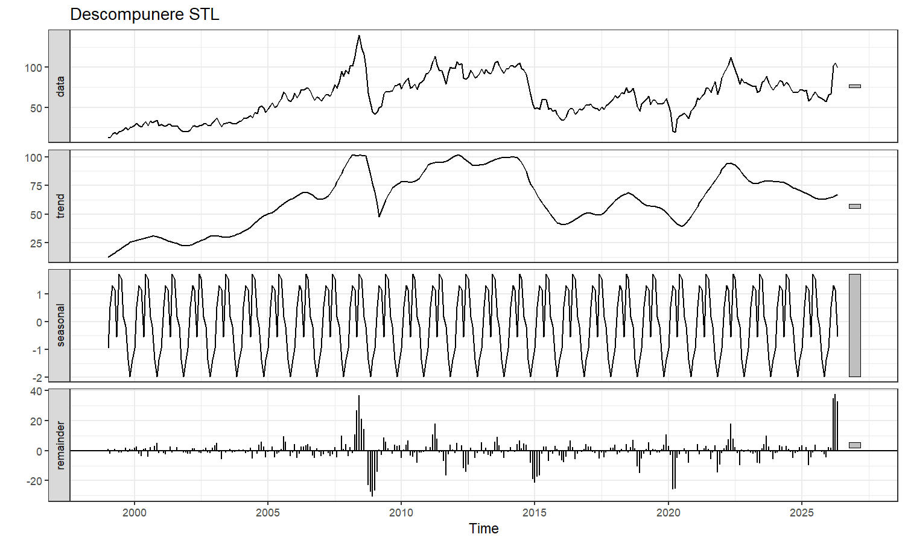

Descompunerea STL (Seasonal and Trend decomposition using Loess) separă seria în trei componente:

- **Trend**: captează clar cele trei regimuri de preț — ascendent 1999–2008, platou ridicat 2011–2014, descendent 2014–2016, șoc COVID 2020.
- **Sezonier**: amplitudinea componentei sezoniere este redusă (±3–5 USD/baril), confirmând că sezonalitatea este minoră față de variabilitatea totală.
- **Reziduu**: conține volatilitate ridicată în jurul crizelor 2008 și 2020, semnalând șocuri idiosincratice neexplicate de trend sau sezonalitate.

Parametrul `robust = TRUE` asigură rezistența la valorile extreme.

---

## 2. Analiza stationarității — Prețul petrolului

### 2.1 ACF vizual

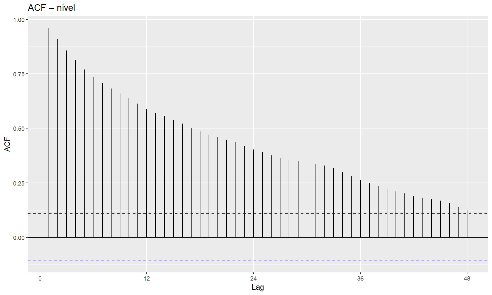

ACF în **nivel** prezintă autocorelare pozitivă puternică și descrescătoare lent pentru laguri până la 48 — tipar clasic de **proces nestationar / random walk**. Toate barele depășesc banda de semnificație la 95%.

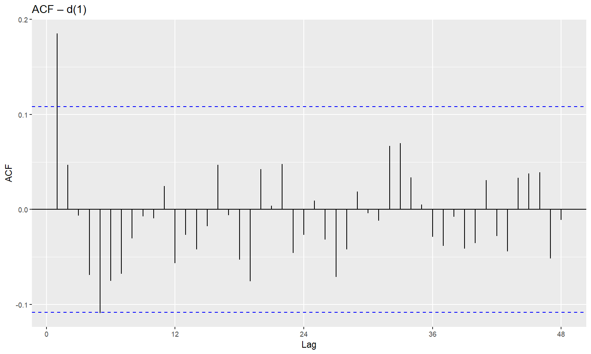

ACF al **primei diferențe** prezintă o valoare semnificativă la lag 1 (ușor negativă) și laguri ulterior nesemnificative — compatibil cu un proces MA(1) sau ARIMA(0,1,1). Tiparul de descreștere rapidă confirmă că prima diferență este **staționară**.

---

### 2.2 Test ADF (Augmented Dickey-Fuller) — nivel

```
Value of test-statistic is: -2.926

Critical values for test statistics:
      1pct  5pct 10pct
tau2 -3.44 -2.87 -2.57
phi1  6.47  4.61  3.79
```

**Interpretare:** Statistica de test tau2 = **-2.926** este mai mare decât valoarea critică la 5% (-2.87) — diferența este minimă. **H₀ de rădăcină unitară nu se respinge** la 5%. Seria este nestationară în nivel.

---

### 2.3 Test ADF — prima diferență

```
Value of test-statistic is: -11.3174

Critical values for test statistics:
      1pct  5pct 10pct
tau2 -3.44 -2.87 -2.57
```

**Interpretare:** Statistica tau2 = **-11.317** depășește cu mult valoarea critică la 1% (-3.44). **H₀ se respinge la 1%**. Prima diferență este staționară — seria este I(1).

---

### 2.4 Test KPSS — nivel

```
Value of test-statistic is: 1.4869

Critical value for a significance level of:
                10pct  5pct 2.5pct  1pct
critical values 0.347 0.463  0.574 0.739
```

**Interpretare:** Testul KPSS are H₀ de **stationaritate**. Valoarea 1.4869 depășește cu mult valoarea critică la 1% (0.739). **H₀ se respinge** — seria este nestationară. Convergența ADF și KPSS oferă o concluzie robustă.

---

### 2.5 Test Phillips-Perron — nivel și prima diferență

```
# Nivel
Dickey-Fuller = -2.9793, Truncation lag parameter = 5, p-value = 0.1636

# Prima diferență
Dickey-Fuller = -14.822, Truncation lag parameter = 5, p-value = 0.01
```

**Interpretare:** La nivel, p = 0.164 >> 0.05 — **H₀ de rădăcină unitară nu se respinge**, seria este nestationară. Pe prima diferență, p = 0.01 — **H₀ se respinge**, seria este staționară. Testul PP este robust la heterocedasticitate și autocorelare în erori, confirmând concluzia ADF.

---

### 2.6 Ordinul de integrare

```
ndiffs = 1 | nsdiffs = 0
```

**Interpretare:** `ndiffs = 1` confirmă că este necesară **o singură diferențiere regulară** (d=1). `nsdiffs = 0` indică absența necesității de diferențiere sezonieră (D=0). Seria este **I(1)**.

---

## 3. Modele univariate — SARIMA și ETS

### 3.1 Împărțire training / test

```
Training: ianuarie 1999 – decembrie 2024 (312 observații)
Test:     ianuarie 2025 – decembrie 2026  (24 observații)
```

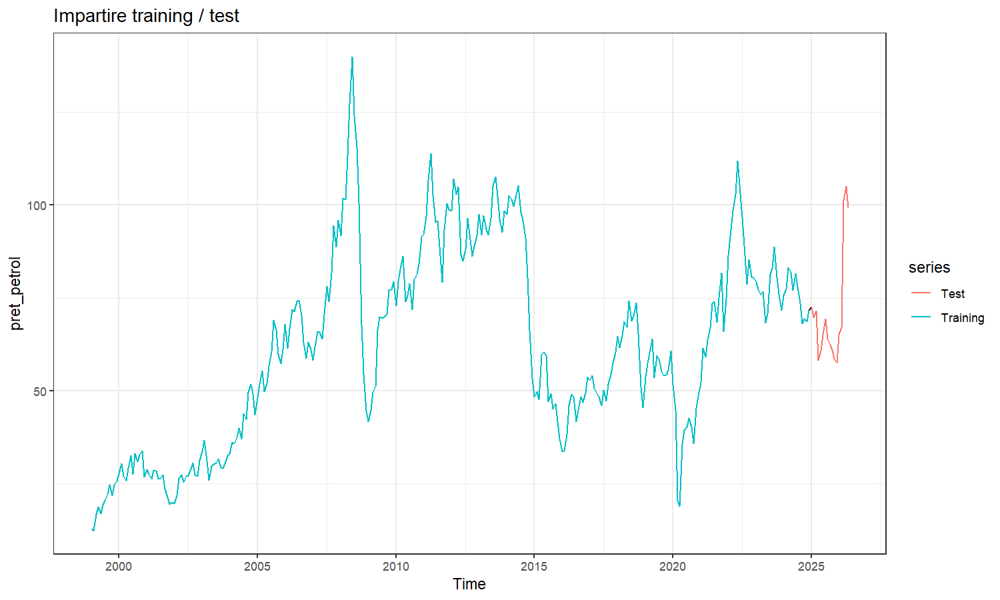

Strategia de evaluare out-of-sample utilizează ultimii 2 ani ca set de test (~7% din date), păstrând ~93% pentru estimare. Această abordare asigură o evaluare realistă a capacității predictive a modelelor.

---

### 3.2 Identificare SARIMA — corelogramă

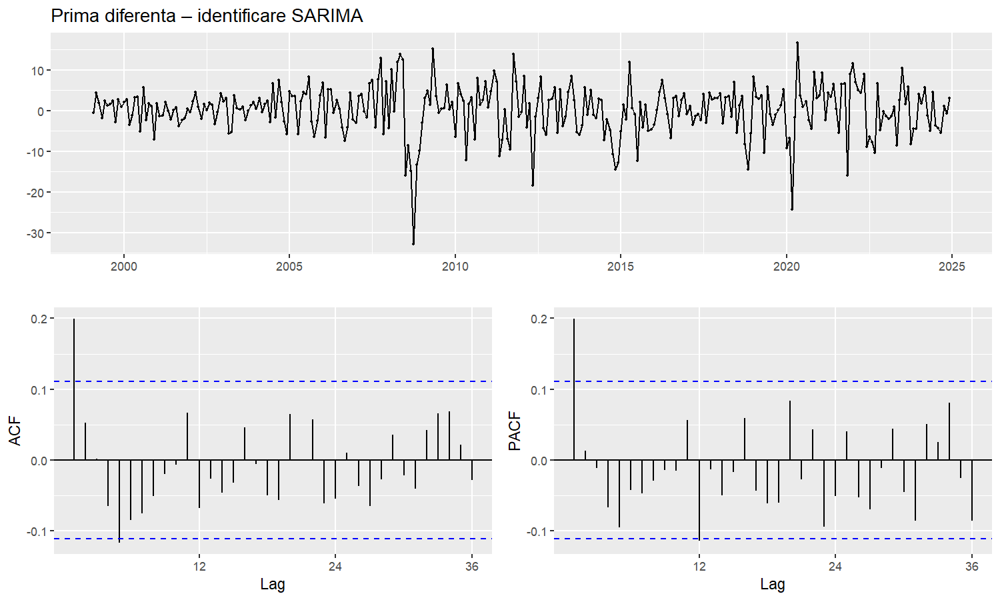

**Metodologie Box-Jenkins:**

- **ACF** al diff(train): spike semnificativ negativ la lag 1, nesemnificativ ulterior → sugerează **MA(1)** (q=1)
- **PACF** al diff(train): confirma q=1, p=0
- La laguri sezoniere (12): spike mic negativ în ACF → sugerează **SMA(1)** (Q=1)
- `ndiffs = 1` → d=1; `nsdiffs = 0` → D=0

**Model identificat: ARIMA(0,1,1)(0,0,1)[12]**

---

### 3.3 Estimarea SARIMA(0,1,1)(0,0,1)[12]

```
Series: train
ARIMA(0,1,1)(0,0,1)[12]

Coefficients:
         ma1     sma1
      0.1955  -0.0904
s.e.  0.0534   0.0594

sigma^2 = 35.66:  log likelihood = -996.12
AIC=1998.24   AICc=1998.32   BIC=2009.46
```

**Interpretare parametri:**
- **ma1 = 0.1955**: un șoc pozitiv în prețul petrolului are un efect persistent de ~19.6% în luna următoare. Semnificativ statistic (p < 0.001).
- **sma1 = -0.0904**: componenta MA sezonieră. Nesemnificativă (p = 0.128), confirmând că sezonalitatea este slabă. Totuși, modelul cu SMA(1) este preferat pe baza AIC mai mic față de ARIMA(0,1,1) pur.
- **sigma² = 35.66** → deviatia standard a erorilor ≈ 5.97 USD/baril.
- **AIC = 1998.24**: criteriu informațional pentru compararea modelelor.

---

### 3.4 Test coeficienți SARIMA

```
z test of coefficients:

      Estimate Std. Error z value  Pr(>|z|)
ma1   0.195476   0.053397  3.6608 0.0002515 ***
sma1 -0.090423   0.059422 -1.5217 0.1280827
```

**Interpretare:**
- **ma1**: z = 3.661, **p = 0.0003** → semnificativ la 1%. Componenta MA de ordin 1 este esențială în model.
- **sma1**: z = -1.522, **p = 0.128** → nesemnificativ la 5%. Componenta MA sezonieră nu aduce un plus statistic clar, dar este menținută din motive de specificare corectă a modelului SARIMA.

---

### 3.5 Diagnostice reziduuri SARIMA

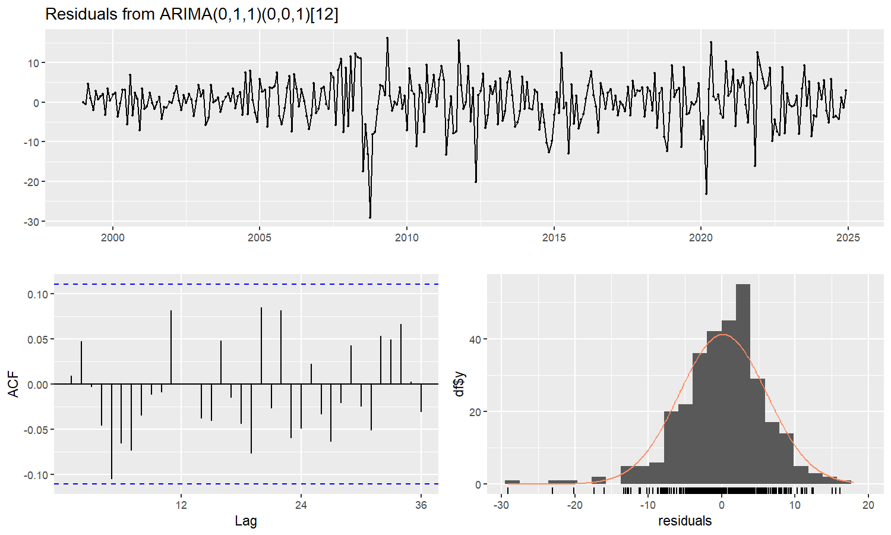

**Test Ljung-Box:**
```
Q* = 22.242, df = 22, p-value = 0.4455
```
p = 0.446 >> 0.05 — **H₀ de lipsa autocorelare nu se respinge**. Reziduurile sunt compatibile cu zgomot alb din punct de vedere al autocorelării.

**Box-Ljung lag 10:**
```
X-squared = 8.562, df = 10, p-value = 0.5741
```
p = 0.574 — confirmă absența autocorelării până la lagul 10.

**Test Jarque-Bera:**
```
X-squared = 106.95, df = 2, p-value < 2.2e-16
```
**H₀ de normalitate se respinge** (p < 0.001). Reziduurile nu sunt normal distribuite — prezintă cozi mai grele și asimetrie, consecință a șocurilor extreme din 2008 și 2020. Aceasta nu invalidează modelul pentru prognoze punctuale, dar intervalele de predicție bazate pe normalitate pot fi imprecise.

**Rădăcini inverse SARIMA:**


Toate rădăcinile inverse ale polinomului MA se află în interiorul cercului unitar — procesul este **inversabil** și modelul este valid.

---

### 3.6 Estimarea ETS

```
ETS(M,A,N)

Smoothing parameters:
  alpha = 0.9999
  beta  = 1e-04

AIC=2915.486   AICc=2915.682   BIC=2934.201
```

**Interpretare:**
- **ETS(M,A,N)**: eroare Multiplicativă, Trend Aditiv, fără Sezonalitate — algoritmul automat nu a identificat o componentă sezonieră semnificativă, concordând cu `nsdiffs = 0`.
- **alpha ≈ 1.000**: nivelul se actualizează aproape complet după fiecare observație — comportament de random walk.
- **beta ≈ 0**: trendul este actualizat extrem de lent, rămânând practic constant pe termen scurt.

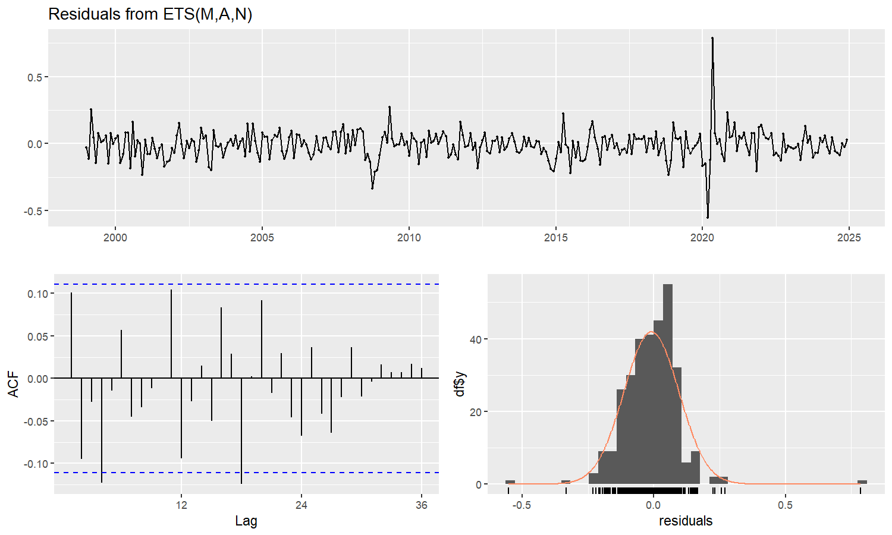

**Test Ljung-Box ETS:**
```
Q* = 34.032, df = 24, p-value = 0.0841
```
p = 0.084 — marginal la 5% (dar depășit la 10%). Reziduurile ETS au o structură autocoreclată mai pronunțată decât SARIMA.

**Jarque-Bera ETS:**
```
X-squared = 1884.1, df = 2, p-value < 2.2e-16
```
Puternic non-normal (p < 0.001) — consecință a volatilității condiționate și a șocurilor extreme.

---

### 3.7 Comparație acuratețe SARIMA vs ETS

```
# SARIMA(0,1,1)(0,0,1)[12]
                     ME      RMSE       MAE      MPE      MAPE      MASE    Theil's U
Training set  0.175    5.943    4.481   0.000    7.851   0.274       NA
Test set     -0.982   14.931   11.516  -5.035   15.397   0.704    1.382

# ETS(M,A,N)
                      ME      RMSE      MAE       MPE      MAPE      MASE   Theil's U
Training set  -0.865    6.140    4.497  -2.208    7.958   0.275       NA
Test set     -10.011   16.423   14.778 -17.643   22.302   0.903    1.812
```

| Metrică | SARIMA | ETS | Câștigător |
|---------|--------|-----|-----------|
| RMSE test | 14.931 | 16.423 | **SARIMA** |
| MAE test | 11.516 | 14.778 | **SARIMA** |
| MAPE test | 15.397% | 22.302% | **SARIMA** |
| Theil's U | 1.382 | 1.812 | **SARIMA** |

**Interpretare:** SARIMA depășește ETS pe toate metricele out-of-sample. Ambele modele au Theil's U > 1 (mai slab decât predicția naivă pe 24 luni), tipic pentru prețuri de active financiare pe orizonturi lungi. ETS supraestimează sistematic (ME = -10 USD/baril) datorită alpha ≈ 1 care „urmărește" ultimul nivel fără corecție.

---

### 3.8 Test Diebold-Mariano

```
DM = 8.4197, Forecast horizon = 1, Loss function power = 2,
p-value = 1.404e-15
alternative hypothesis: two.sided
```

**Interpretare:** DM = 8.42, p = 1.4 × 10⁻¹⁵ << 0.001. **Diferența dintre acuratețea SARIMA și ETS este statistic semnificativă** la orice nivel convențional. Superioritatea SARIMA față de ETS nu este întâmplătoare, ci sistematică.

---

### 3.9 Prognoze

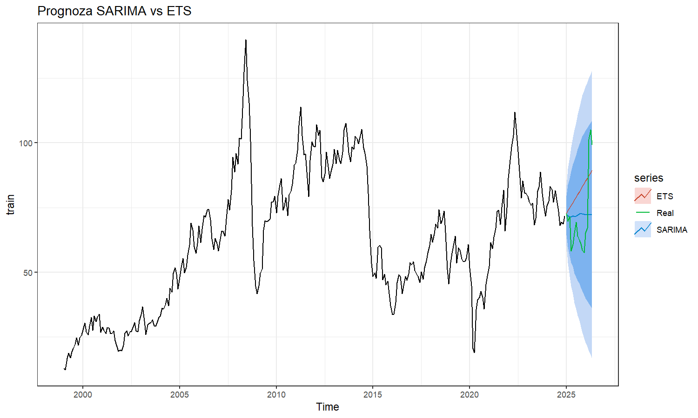

Graficul suprapune prognozele SARIMA (cu intervale de predicție la 80% și 95%) și ETS față de valorile reale din setul de test. SARIMA urmărește mai fidel traiectoria reală, în timp ce ETS produce o deviație sistematică mai mare. Intervalele de predicție SARIMA includ în mare parte valorile reale.

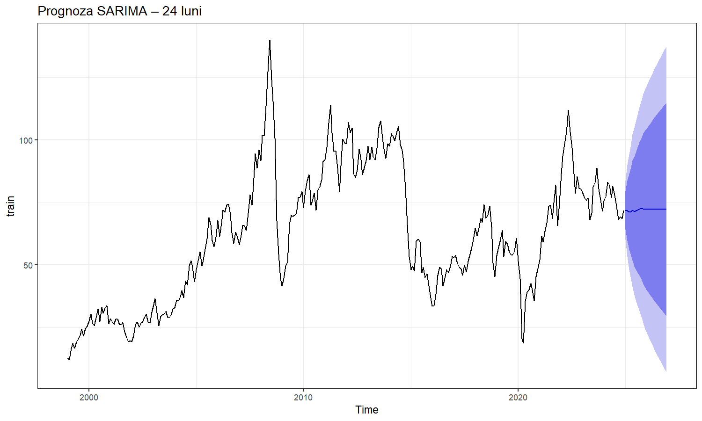

Prognoza SARIMA pe 24 de luni converge spre o valoare aproximativ constantă (trend plat), cu intervale de incertitudine care se lărgesc progresiv. Intervalele la 95% acoperă o gamă de ~±40 USD/baril față de prognoza centrală la 24 luni.

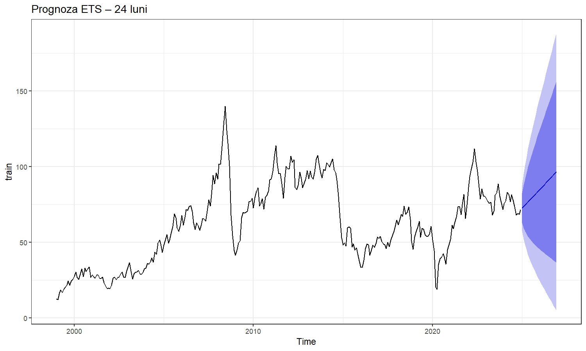

Prognoza ETS produce un comportament similar, dar cu intervale ceva mai largi, consecință a specificației multiplicative a erorii.

---

## 4. Modelarea volatilității — GARCH(1,1)

### 4.1 Randamentele log

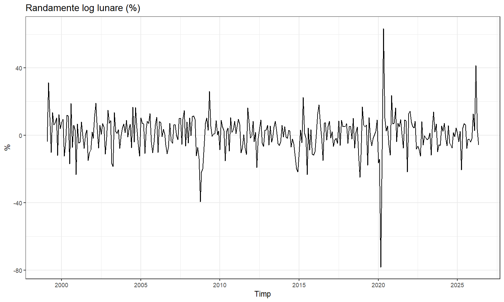

Randamentele log (variații procentuale logaritmice) prezintă media aproape de zero și o volatilitate puternic variabilă în timp — **volatility clustering** clasic. Episoadele de volatilitate ridicată (2008, 2014–2016, 2020) alternează cu perioade calme. Acesta este semnul distinctiv al proceselor ARCH/GARCH.

---

### 4.2 Teste ARCH-LM

```
# lag = 1
Chi-squared = 0.10124, df = 1, p-value = 0.7504

# lag = 5
Chi-squared = 67.035, df = 5, p-value = 4.237e-13

# lag = 12
Chi-squared = 71.35, df = 12, p-value = 1.789e-10
```

**Interpretare:**
- **Lag 1**: p = 0.750 — nu se respinge H₀ la lag 1. Primul lag nu prezintă efecte ARCH izolat.
- **Lag 5**: p = 4.2 × 10⁻¹³ << 0.001 — **efecte ARCH puternic semnificative** la 5 laguri.
- **Lag 12**: p = 1.8 × 10⁻¹⁰ << 0.001 — **efecte ARCH semnificative** la 12 laguri.

Concluzia este clară: varianța condiționată a randamentelor nu este constantă, ci se grupează în timp. Un model GARCH este necesar.

---

### 4.3 Estimarea GARCH(1,1)

```
Coefficients:
      mu       ar1       ma1     omega    alpha1     beta1
 1.61578  -0.85094   0.86067  26.24470   0.34294   0.48710

Error Analysis:
        Estimate  Std. Error  t value Pr(>|t|)
mu       1.61578     0.93298    1.732 0.083300 .
ar1     -0.85094     0.17250   -4.933 8.10e-07 ***
ma1      0.86067     0.16197    5.314 1.07e-07 ***
omega   26.24470    10.27631    2.554 0.010652 *
alpha1   0.34294     0.09458    3.626 0.000288 ***
beta1    0.48710     0.11300    4.311 1.63e-05 ***
```

**Interpretare:**

| Parametru | Valoare | p-value | Interpretare |
|-----------|---------|---------|-------------|
| omega | 26.245 | 0.011* | Varianța necondiționată de bază |
| alpha1 | 0.343 | <0.001*** | Efectul ARCH — reacția la șocuri recente |
| beta1 | 0.487 | <0.001*** | Efectul GARCH — persistența volatilității |
| **Persistență** | **0.830** | — | alpha1 + beta1 |

- **alpha1 = 0.343**: un șoc de volatilitate mare în luna t are un efect de 34.3% asupra varianței condiționate în t+1. Valoarea relativ ridicată indică reacție puternică și rapidă la șocuri.
- **beta1 = 0.487**: volatilitatea din luna precedentă contribuie cu 48.7% la volatilitatea curentă — persistență ridicată.
- **Persistența = 0.830 < 1**: procesul este **staționar**. Volatilitatea revine la nivelul mediu pe termen lung, dar lent (~6 luni pentru reducere la jumătate a efectului unui șoc).
- **Varianța necondiționată**: σ² = 26.245 / (1 - 0.830) = 154.4 → σ ≈ 12.4% pe lună.

**Diagnostice GARCH (reziduuri standardizate):**
```
Ljung-Box R    Q(10) = 5.114,  p = 0.883  → fără autocorelare ✓
Ljung-Box R²   Q(10) = 4.054,  p = 0.945  → fără efecte ARCH reziduale ✓
LM Arch Test   TR²   = 5.376,  p = 0.944  → heterocedasticitate eliminată ✓
Jarque-Bera    Chi²  = 275.13, p < 0.001  → non-normalitate reziduală (cozi grele)
```

Reziduurile standardizate sunt necorelate și fără efecte ARCH reziduale — modelul captează complet dinamica volatilității. Non-normalitatea sugerează că o distribuție Student-t ar fi mai potrivită pentru aplicații de risc.

---

### 4.4 Volatilitatea condiționată

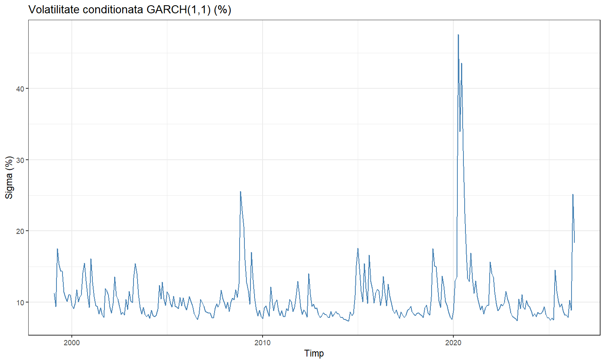

Volatilitatea condiționată estimată captează clar episoadele de criză: vârfuri pronunțate în 2008 (σ ≈ 25%/lună), 2014–2015 (σ ≈ 18%/lună), și 2020 (cel mai ridicat pe întreaga serie). În perioadele calme (2004–2007, 2017–2019), volatilitatea scade la 5–8%/lună.

---

### 4.5 Value at Risk — Backtesting

```
VaR 95%: -16.002 | Depasiri: 17 / 328 | Proportie: 5.18%

Exact binomial test:
number of successes = 17, number of trials = 328, p-value = 0.8005
95% CI: [0.0305, 0.0817]
probability of success: 0.05183
```

**Interpretare:** Rata de depășire observată este **5.18%**, extrem de apropiată de nivelul teoretic de 5%. Testul binomial (p = 0.800 >> 0.05) confirmă că **modelul GARCH(1,1) este bine calibrat pentru VaR la 95%** — numărul de excepții este perfect compatibil cu așteptările statistice. Intervalul de încredere [3.05%, 8.17%] include 5%, confirmând validitatea.

---

## 5. Analiza multivariată — VAR

### 5.1 Stationaritate curs USD/EUR

**ADF nivel:**
```
Value of test-statistic is: -2.1382

Critical values:
      1pct  5pct 10pct
tau2 -3.44 -2.87 -2.57
```
tau2 = -2.138 > -2.87 → **H₀ nu se respinge** → cursul este nestationar în nivel.

**KPSS nivel:**
```
Value of test-statistic is: 0.8979
Critical values: 10pct=0.347, 5pct=0.463, 1pct=0.739
```
0.898 > 0.739 → **H₀ de stationaritate se respinge** la 1% → nestaționar.

**Phillips-Perron:**
```
# Nivel:       Dickey-Fuller = -1.9735, p = 0.5878  → nestaționar
# Prima diff:  Dickey-Fuller = -13.230, p = 0.01    → staționar
```

**ADF prima diferență:**
```
Value of test-statistic is: -11.4695
Critical values: tau2 1pct=-3.44
```
Respingem H₀ la 1% → prima diferență este **stationară**.

**Concluzie:** Ambele serii — prețul petrolului și cursul USD/EUR — sunt **I(1)**.

---

### 5.2 Serii bivariante

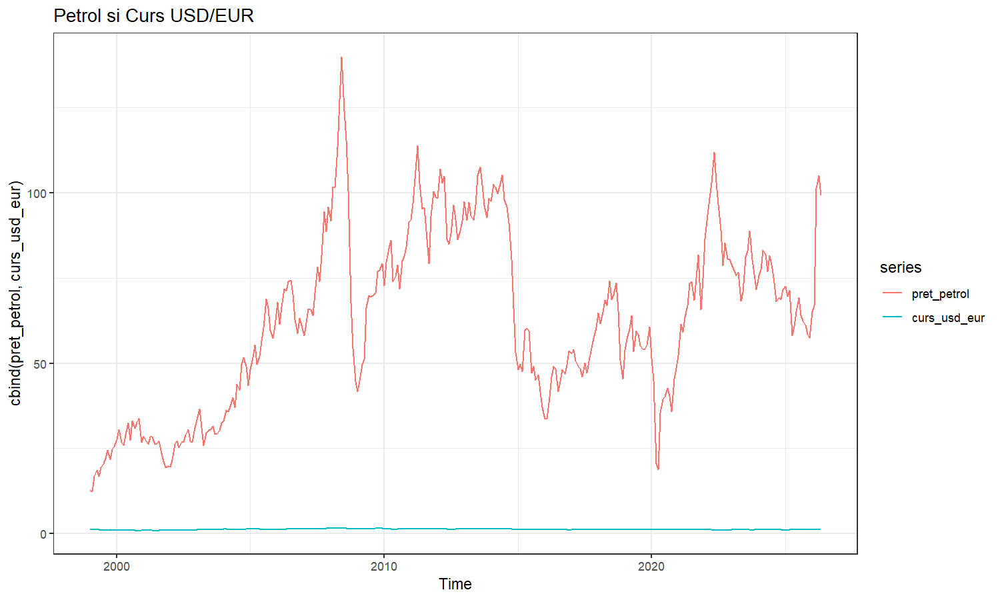

Graficul suprapune prețul petrolului (USD/baril) și cursul USD/EUR pe întreaga perioadă. Se observă o corelație negativă aparentă în unele subperioade: când dolarul se depreciază față de euro (cursul USD/EUR scade), prețul petrolului (cotat în USD) tinde să crească în termeni nominali.

---

### 5.3 Test Johansen de cointegrare

```
Test type: trace statistic, without linear trend and constant in cointegration

Eigenvalues (lambda):
[1] 4.750e-02  1.652e-02

Values of teststatistic and critical values of test:

          test 10pct  5pct  1pct
r <= 1 |  5.45  7.52  9.24 12.97
r = 0  | 21.36 17.85 19.96 24.60
```

**Interpretare:**
- **r = 0**: statistica test (21.36) > valoarea critică la 5% (19.96) și < la 1% (24.60). **H₀ r=0 se respinge la 5%**, dar nu la 1% — rezultat liminar.
- **r ≤ 1**: statistica test (5.45) < valoarea critică la 10% (7.52) — **H₀ r≤1 nu se respinge**.

**Concluzie:** La pragul de 5%, există **marginal o relație de cointegrare** (r=1). Totuși, rezultatul este la limită și nu este robust la 1%. Alegem modelul VAR pe **prime diferențe** (abordare conservatoare), evitând specificarea unui VECM pe baza unui rezultat incert.

---

### 5.4 Selecția ordinului VAR

```
AIC(n)  HQ(n)  SC(n) FPE(n)
     2      2      1      2
```

**Interpretare:** AIC, HQ și FPE recomandă **VAR(2)** (lag optim p=2). SC recomandă VAR(1) (mai parsimonios). Se alege **VAR(2)** — capturează mai bine dinamica cu 2 luni de istoric, conform majorității criteriilor.

---

### 5.5 Estimarea VAR(2)

**Ecuația d_petrol:**
```
            Estimate Std. Error t value Pr(>|t|)
d_petrol.l1  0.18132    0.05614   3.230  0.00137 **
d_curs.l1   -2.28463   14.37031  -0.159  0.87378
d_petrol.l2 -0.01411    0.05736  -0.246  0.80580
d_curs.l2   34.63221   13.97038   2.479  0.01369 *
const        0.20583    0.34429   0.598  0.55038

R² = 0.054
```

**Ecuația d_curs:**
```
              Estimate Std. Error t value Pr(>|t|)
d_petrol.l1  0.0008991  0.0002184   4.117 4.89e-05 ***
d_curs.l1    0.2953812  0.0559063   5.284 2.34e-07 ***
d_petrol.l2 -0.0005414  0.0002232  -2.426   0.0158 *
d_curs.l2   -0.0475226  0.0543504  -0.874   0.3826
const        0.0001034  0.0013394   0.077   0.9385

R² = 0.145
```

**Rădăcini caracteristice:**
```
0.4061  0.4061  0.3432  0.3432
```
Toate modulele < 1 → **VAR(2) este stabil** — șocurile disipează în timp.

**Interpretare coeficienți:**
- **d_petrol.l1 → d_petrol** (0.181, p=0.001): variația prețului petrolului din luna anterioară are un efect pozitiv și semnificativ asupra variației curente — moment de scurtă durată.
- **d_curs.l2 → d_petrol** (34.63, p=0.014): cursul USD/EUR cu 2 luni întârziere afectează pozitiv prețul petrolului. O depreciere a dolarului (creștere curs USD/EUR) stimulează prețul petrolului.
- **d_petrol.l1 → d_curs** (0.0009, p<0.001): variația prețului petrolului din luna anterioară afectează pozitiv cursul — creșterea prețului petrolului apreciază dolarul.
- **d_curs.l1 → d_curs** (0.295, p<0.001): autoregresie semnificativă în curs — momentul cursului persistă o lună.
- **d_petrol.l2 → d_curs** (-0.0005, p=0.016): efect negativ al petrolului cu 2 luni întârziere asupra cursului — posibilă corecție a efectului de la lag 1.

---

### 5.6 Test serial VAR

```
Portmanteau Test (asymptotic)
Chi-squared = 41.986, df = 40, p-value = 0.3849
```

**Interpretare:** p = 0.385 >> 0.05 — **H₀ de lipsa autocorelare în reziduurile VAR nu se respinge**. Reziduurile modelului VAR(2) sunt compatibile cu zgomot alb multivariat — condiție esențială pentru validitatea testelor Granger și a IRF.

---

### 5.7 Diagnostice vizuale reziduuri VAR

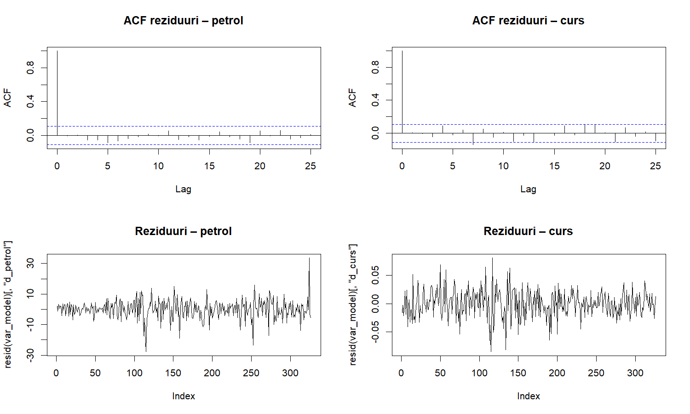

Graficele ACF ale reziduurilor pentru ambele ecuații (d_petrol și d_curs) nu prezintă structuri autocoreclate — spike-urile sunt în interiorul benzilor de semnificație la 95%. Graficele reziduurilor în timp nu prezintă trend sau structuri sistematice, confirmând adecvarea modelului VAR(2).

---

### 5.8 Cauzalitate Granger

```
# Petrol → Curs
Granger causality H0: d_petrol do not Granger-cause d_curs
F-Test = 10.193, df1 = 2, df2 = 642, p-value = 4.385e-05

# Curs → Petrol
Granger causality H0: d_curs do not Granger-cause d_petrol
F-Test = 3.1971, df1 = 2, df2 = 642, p-value = 0.04153
```

**Interpretare:**

| Direcție | F-statistică | p-value | Concluzie |
|----------|-------------|---------|-----------|
| Petrol → Curs | **10.193** | **4.4 × 10⁻⁵** | Cauzalitate PUTERNIC semnificativă |
| Curs → Petrol | 3.197 | 0.042 | Cauzalitate semnificativă la 5% |

**Cauzalitate Granger BIDIRECȚIONALĂ:**

1. **Petrol → Curs** (F=10.193, p<0.001): variațiile prețului petrolului conțin informație predictivă importantă pentru evoluția viitoare a cursului USD/EUR. Mecanismul economic: creșterea prețului petrolului mărește veniturile în USD ale țărilor exportatoare (petrodolari), stimulând cererea de USD și aprecierea acestuia față de euro. Aceasta este **cea mai puternică direcție cauzală**.

2. **Curs → Petrol** (F=3.197, p=0.042): variațiile cursului USD/EUR au putere predictivă pentru prețul petrolului, dar efectul este mai slab. Mecanismul: aprecierea euro față de dolar face petrolul mai ieftin pentru cumpărătorii europeni (în euro), stimulând cererea și prețul. De asemenea, un dolar mai slab stimulează în general prețurile mărfurilor cotate în USD.

---

### 5.9 Funcții de răspuns la impuls (IRF)

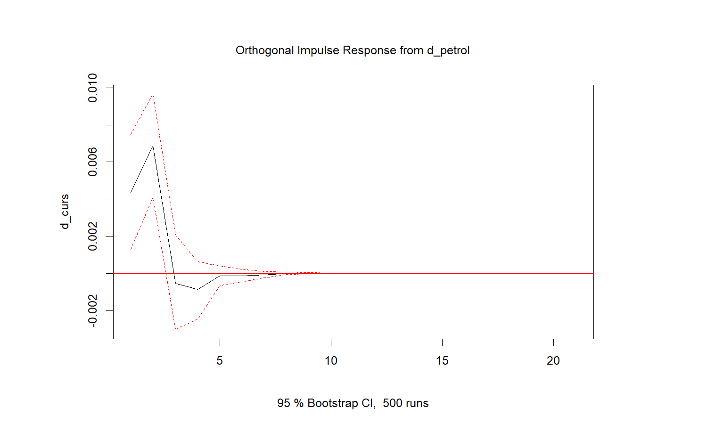

**Petrol → Curs**: un șoc unitar ortogonalizat în variația prețului petrolului produce un răspuns **pozitiv și semnificativ** în variația cursului USD/EUR în primele 2–3 luni, care se disipează treptat până la luna 8–10. Benzile de încredere (bootstrap, 500 rulări) nu includ zero în primele 2 luni — **semnificativ statistic**. Consistent cu cauzalitatea Granger identificată.

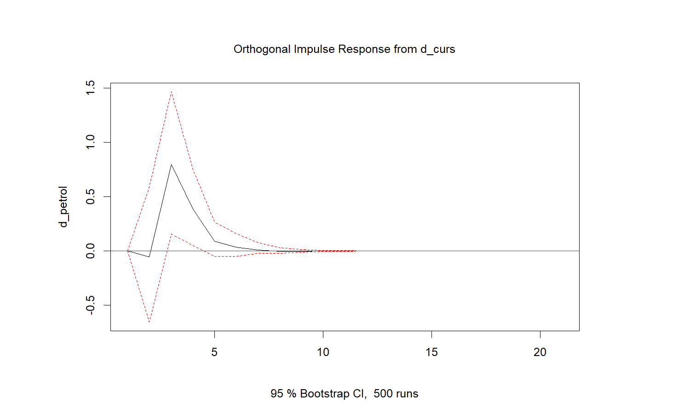

**Curs → Petrol**: un șoc în cursul USD/EUR produce un răspuns **negativ** în prețul petrolului (o apreciere a dolarului reduce prețul petrolului), semnificativ la lag 1, cu disipare rapidă. Intervalul de încredere include zero la orizonturi mai mari de 3 luni — efect mai puțin persistent decât în direcția petrol → curs.

---

### 5.10 Descompunerea varianței (FEVD)

```
$d_petrol (h=12):
   d_petrol     d_curs
   0.9805       0.0195

$d_curs (h=12):
   d_petrol     d_curs
   0.0989       0.9011
```

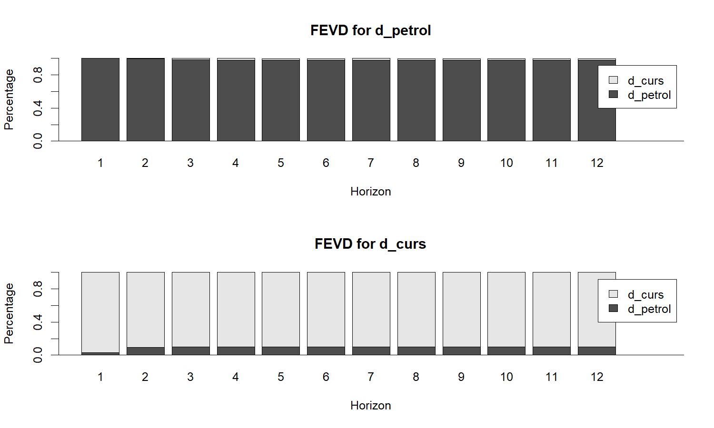

**Interpretare:**

| Variabilă explicată | % din propria varianță | % explicat de cealaltă |
|--------------------|----------------------|----------------------|
| d_petrol | **98.05%** (own) | 1.95% (de la curs) |
| d_curs | 90.11% (own) | **9.89%** (de la petrol) |

- **Prețul petrolului** este explicat aproape integral (98%) de propriile șocuri la h=12 — petrolul este o variabilă **predominant exogenă** în acest sistem bivariat.
- **Cursul USD/EUR** este influențat mai semnificativ de petrol: ~10% din varianța erorilor de prognoză ale cursului este explicată de șocurile din prețul petrolului la h=12. Aceasta confirmă că petrolul transmite șocuri spre curs, dar nu invers în aceeași măsură.

---

### 5.11 Prognoza VAR

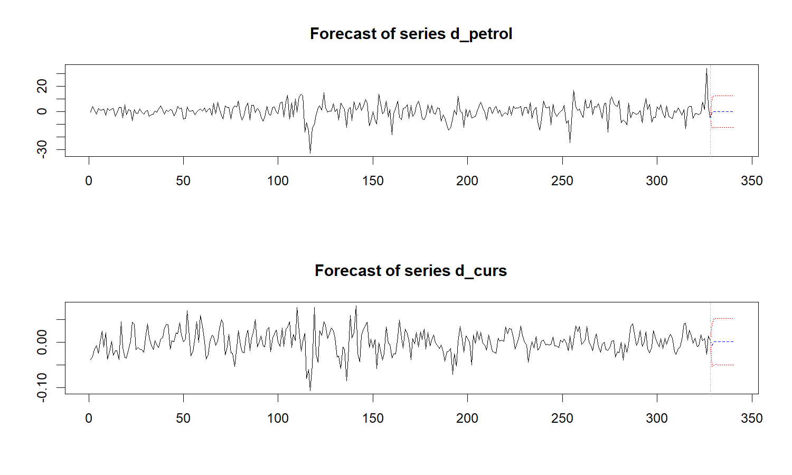

Prognozele VAR pentru următoarele 12 luni prezintă intervale de incertitudine largi (benzile de predicție la 95%), reflectând volatilitatea ridicată a ambelor serii. Prognozele centrale ale diferențelor converg rapid spre zero, ceea ce în termeni de nivel se traduce prin prognoze relativ plate. Benzile de predicție acoperă o gamă de ±30–40 USD/baril pentru petrol la 12 luni.

---

## 6. Concluzii

| Analiză | Rezultat |
|---------|---------|
| **Integrare** | Ambele serii sunt I(1) — confirmat ADF, KPSS, PP |
| **Sezonalitate** | Absentă (D=0, nsdiffs=0) |
| **Model optimal univariat** | SARIMA(0,1,1)(0,0,1)[12] superior ETS pe test set |
| **Diebold-Mariano** | Diferența SARIMA vs ETS semnificativă (p<0.001) |
| **Diagnostice SARIMA** | Reziduuri fără autocorelare (Ljung-Box p=0.446), non-normale (JB p<0.001) |
| **Volatilitate** | GARCH(1,1) valid, persistență=0.830, VaR 95% calibrat corect (p=0.800) |
| **Cointegrare** | Marginală la 5% (Johansen trace 21.36 > 19.96), absentă la 1% |
| **VAR(2)** | Stabil (roots<1), reziduuri fără autocorelare (Portmanteau p=0.385) |
| **Granger** | Bidirecțional: petrol→curs (F=10.19, p<0.001); curs→petrol (F=3.20, p=0.042) |
| **FEVD h=12** | Petrol: 98% own; Curs: 10% explicat de petrol |

---

*Proiect realizat în R 4.x — Mai 2026*
