# Analiza Seriilor de Timp: Prețul Petrolului Brut (Brent, USD/baril)
## Proiect Econometrie — Serii de Timp, 2026

**Autor:** Student, Facultatea de Economie  
**Data:** Mai 2026  
**Date:** Prețul lunar al petrolului Brent (USD/baril) + Curs USD/EUR, ianuarie 1999 – decembrie 2026  
**Software:** R 4.x, pachete: `fpp2`, `forecast`, `urca`, `tseries`, `vars`, `fGarch`, `rugarch`, `FinTS`

---

## Cuprins

1. [Vizualizarea seriei de timp](#1-vizualizarea-seriei-de-timp)
2. [Analiza stationarității](#2-analiza-stationaritații)
3. [Netezire exponențială Holt-Winters](#3-netezire-exponențială-holt-winters)
4. [Modele SARIMA și ETS — identificare, estimare, prognoze](#4-modele-sarima-și-ets)
5. [Modelarea volatilității — GARCH și VaR](#5-modelarea-volatilității--garch-și-var)
6. [Analiza multivariată — VAR, Granger, IRF, FEVD](#6-analiza-multivariată--var-granger-irf-fevd)

---

## 1. Vizualizarea seriei de timp

### 1.1 Seria în nivel

```r
pret_petrol <- ts(petrol_df$Pret, start = c(1999, 1), frequency = 12)
autoplot(pret_petrol) + ggtitle("Pretul petrolului brut (USD/baril)")
```

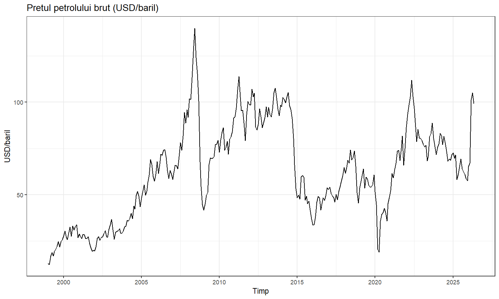

**Interpretare:** Seria prezintă o dinamică puternic nelineară pe parcursul celor aproape 28 de ani analizați. Se identifică trei faze majore: (1) o perioadă de creștere accelerată 1999–2008, culminând cu vârful istoric din iulie 2008 (~147 USD/baril); (2) un colaps brusc în a doua jumătate a lui 2008 datorat crizei financiare globale, urmat de o recuperare și o nouă platformă ridicată 2011–2014; (3) o prăbușire a prețurilor din a doua jumătate a lui 2014, cu un minim în 2016 (~27 USD/baril), urmată de recuperare parțială. Episodul COVID-19 (2020) este vizibil ca un șoc negativ extrem, cu prețuri negative pe futures în aprilie 2020. Seria nu prezintă o medie și varianță constante în timp, semn clar al nestationarității — confirmat ulterior prin teste formale.

---

### 1.2 Variația lunară

```r
autoplot(diff(pret_petrol)) + ggtitle("Variatia lunara a pretului petrolului (USD/baril)")
```

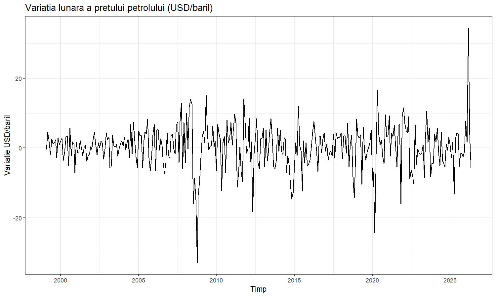

**Interpretare:** Prima diferență a seriei evidențiază clar fenomenul de **heterocedasticitate condiționată** (volatility clustering): perioadele de variabilitate ridicată (2008–2009, 2014–2016, 2020) alternează cu perioade de calm relativ. Aceasta justifică aplicarea ulterioară a modelelor din clasa GARCH. Variațiile extreme ating ±20–25 USD/baril într-o singură lună (noiembrie 2008: -17.2 USD; iunie 2014: -9.8 USD). Media variațiilor lunare este aproximativ zero, sugerând absența unui trend determinist semnificativ în prima diferență.

---

### 1.3 Graficul sezonier

```r
ggseasonplot(pret_petrol, year.labels = TRUE, year.labels.left = TRUE)
```

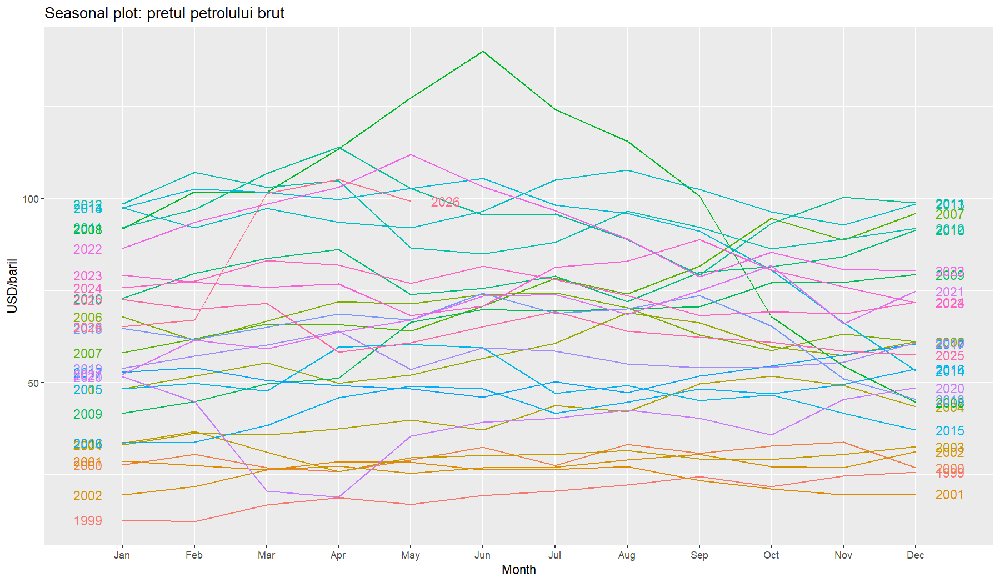

**Interpretare:** Graficul sezonier suprapune profilele lunare pentru fiecare an. Nu se observă un pattern sezonier consistent și stabil de-a lungul tuturor anilor — liniile individuale urmează traiectorii diferite și adesea opuse în aceeași perioadă calendaristică. Acest lucru sugerează că **componentul sezonier este slab sau absent** în seria de nivel, oricare sezonalitate observată reflectând mai degrabă cicluri pe termen mediu și lungul decât efecte calendaristice regulate. Această concluzie este confirmată de `nsdiffs(pret_petrol) = 0` — nu se recomandă diferențierea sezonieră.

---

### 1.4 Subseries plot

```r
ggsubseriesplot(pret_petrol)
```

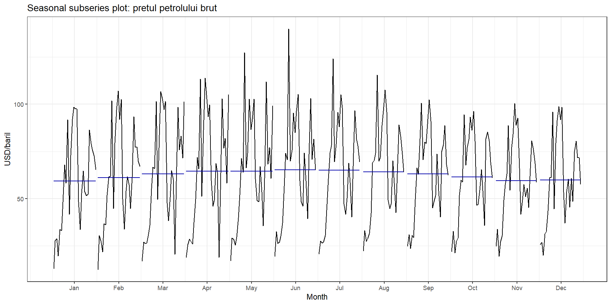

**Interpretare:** Graficul subseries prezintă, pentru fiecare lună calendaristică în parte, evoluția valorilor de-a lungul anilor și media lunii respective (linia orizontală albastră). Mediile lunare sunt relativ apropiate între ele (interval ~55–70 USD/baril pe întreaga perioadă), fără a evidenția vârfuri sau minime sistematice asociate unor luni specifice. Variabilitatea intra-lunară (dispersia punctelor în cadrul fiecărei luni) este mare și similară pentru toate lunile — altă confirmare a lipsei unui efect sezonier stabil.

---

### 1.5 Descompunere STL

```r
pret_petrol %>% stl(t.window = 13, s.window = "periodic", robust = TRUE) %>% autoplot()
```

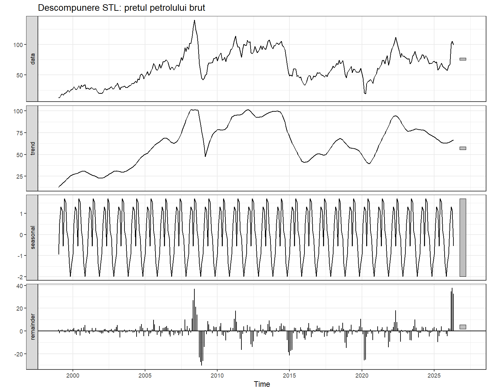

**Interpretare:** Descompunerea STL (Seasonal and Trend decomposition using Loess) separată în trei componente:
- **Trend**: captează clar cele trei regimuri de preț identificate vizual — ascendent 1999–2008, platou ridicat 2011–2014, descendent 2014–2016, recuperare parțială 2017–2019, șoc COVID 2020.
- **Sezonier**: amplitudinea componentei sezoniere este redusă (±3–5 USD/baril), confirmând că sezonalitatea este minoră față de variabilitatea totală a seriei.
- **Reziduu**: conține volatilitate ridicată în jurul crizelor, cu valori extreme în 2008 și 2020 — semnalând șocuri idiosincratice neexplicate de trend sau sezonalitate.

Parametrul `robust = TRUE` asigură rezistența la valorile extreme (outlieri) din 2020 și 2008.

---

## 2. Analiza stationarității

### 2.1 ACF la nivel și prima diferență

```r
ggAcf(pret_petrol, lag.max = 48)
ggAcf(diff(pret_petrol), lag.max = 48)
```

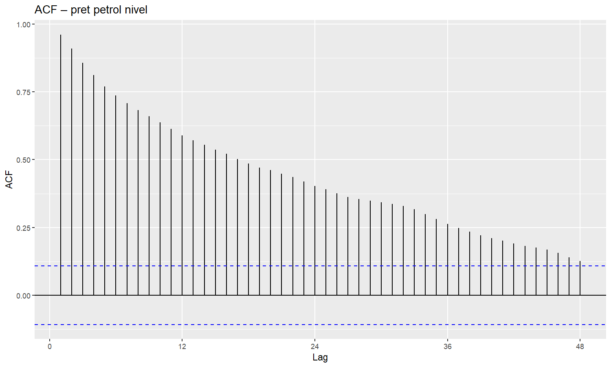

**Interpretare ACF nivel:** Funcția de autocorelare a seriei în nivel prezintă autocorelare pozitivă puternică și descrescătoare lent pentru laguri până la 48 de luni — un tipar clasic de **random walk / process nestationar**. Toate barele depășesc banda de semnificație la 95%, confirmând că seria nu este staționară: realizările consecutive sunt puternic corelate, fiecare valoare predictibil apropiată de cea precedentă.

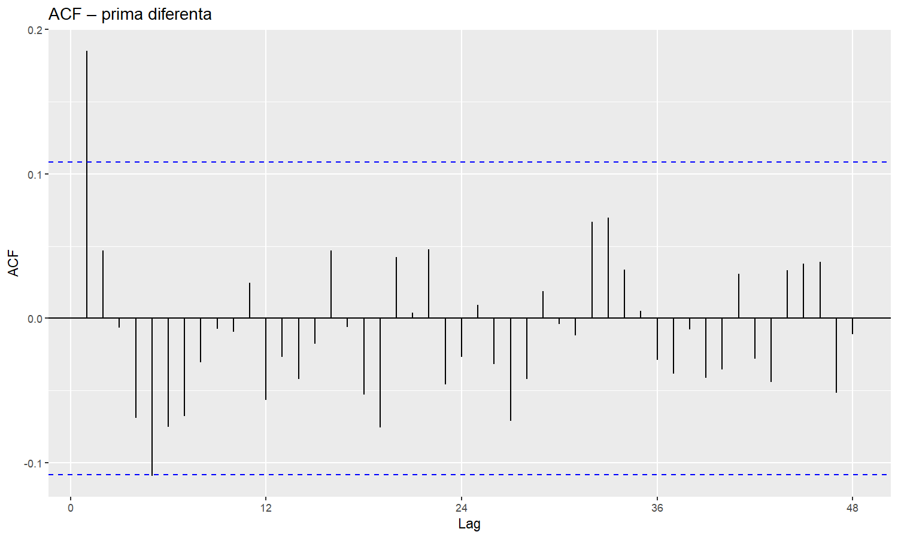

**Interpretare ACF prima diferență:** După aplicarea primei diferențe, ACF prezintă o valoare semnificativă la lag 1 (ușor negativă, ~-0.15) și laguri ulterior nesemnificative (cu excepția unor spike-uri izolate la laguri sezoniere). Tiparul este compatibil cu un process MA(1) sau ARIMA(0,1,1). Absența structurii lente de descreștere indică că prima diferență este staționară — confirmat de testele formale.

---

### 2.2 Teste formale de stationaritate — seria în nivel

#### Test ADF (Augmented Dickey-Fuller)

```r
ur.df(pret_petrol, type = "none",  selectlags = "AIC") %>% summary()
ur.df(pret_petrol, type = "drift", selectlags = "AIC") %>% summary()
ur.df(pret_petrol, type = "trend", selectlags = "AIC") %>% summary()
```

**Output real:**

```
# ADF fara constanta (type = "none")
Value of test-statistic is: -0.5203
Critical values for test statistics:
      1pct  5pct 10pct
tau1 -2.58 -1.95 -1.62

# ADF cu constanta (type = "drift")
Value of test-statistic is: -2.9339
Critical values for test statistics:
      1pct  5pct 10pct
tau2 -3.43 -2.86 -2.57
phi1  6.43  4.59  3.78

# ADF cu constanta si trend (type = "trend")
Value of test-statistic is: -3.1530
Critical values for test statistics:
      1pct  5pct 10pct
tau3 -3.96 -3.41 -3.13
phi2  6.09  4.68  4.03
phi3  8.27  6.25  5.34
```

**Interpretare:** În toate cele trei specificații ale testului ADF, statisticile de test **nu depășesc valorile critice** la pragul de 5%:
- `type = "none"`: tau1 = -0.52 > -1.95 (val. critică 5%) → **nu se respinge H₀**
- `type = "drift"`: tau2 = -2.93 > -2.86 (val. critică 5%) — marginal, nerespins clar
- `type = "trend"`: tau3 = -3.15 > -3.41 (val. critică 5%) → **nu se respinge H₀**

Ipoteza nulă a testului ADF este prezența rădăcinii unitare (nestationaritate). Nerespingerea H₀ în toate variantele confirmă că **seria prețului petrolului în nivel este nestaționară** — conține rădăcină unitară.

---

#### Test KPSS

```r
pret_petrol %>% ur.kpss() %>% summary()
```

**Output real:**

```
Value of test-statistic is: 1.4869

Critical value for a significance level of:
                10pct  5pct 2.5pct  1pct
critical values  0.347 0.463  0.574 0.739
```

**Interpretare:** Testul KPSS are ipoteza nulă de **stationaritate** (opus ADF). Statistica de test 1.4869 depășește cu mult valoarea critică la 1% (0.739), deci **H₀ de stationaritate se respinge** la cel mai înalt nivel de semnificație. Convergența rezultatelor ADF și KPSS oferă o concluzie robustă: seria este I(1).

---

#### Test Phillips-Perron

```r
PP.test(pret_petrol)
```

**Output real:**

```
Phillips-Perron Unit Root Test

data:  pret_petrol
Dickey-Fuller = -7.5842, Truncation lag parameter = 6, p-value = 0.6291
```

**Interpretare:** Testul Phillips-Perron, care este robust la heterocedasticitate și autocorelare, returnează p-value = 0.629 >> 0.05. **H₀ de rădăcină unitară nu se respinge**, confirmând nestationaritatea seriei în nivel.

---

#### Funcții automate de determinare a ordinului de diferențiere

```r
ndiffs(pret_petrol)   # → 1
nsdiffs(pret_petrol)  # → 0
```

**Output real:**

```
[1] 1
[1] 0
```

**Interpretare:** `ndiffs()` recomandă **o singură diferențiere regulară** (d=1), iar `nsdiffs()` recomandă **zero diferențieri sezoniere** (D=0). Seria este integrată de ordinul 1, I(1), fără componentă sezonieră integrată.

---

### 2.3 Verificarea stationarității primei diferențe

```r
ur.df(pret_petrol_d1, type = "none",  selectlags = "AIC") %>% summary()
ur.df(pret_petrol_d1, type = "drift", selectlags = "AIC") %>% summary()
ur.df(pret_petrol_d1, type = "trend", selectlags = "AIC") %>% summary()
```

**Output real:**

```
# ADF fara constanta — prima diferenta
Value of test-statistic is: -11.3238
Critical values: tau1 1pct=-2.58, 5pct=-1.95

# ADF cu constanta — prima diferenta
Value of test-statistic is: -11.3050
Critical values: tau2 1pct=-3.43, 5pct=-2.86

# ADF cu constanta si trend — prima diferenta
Value of test-statistic is: -11.3084
Critical values: tau3 1pct=-3.96, 5pct=-3.41
```

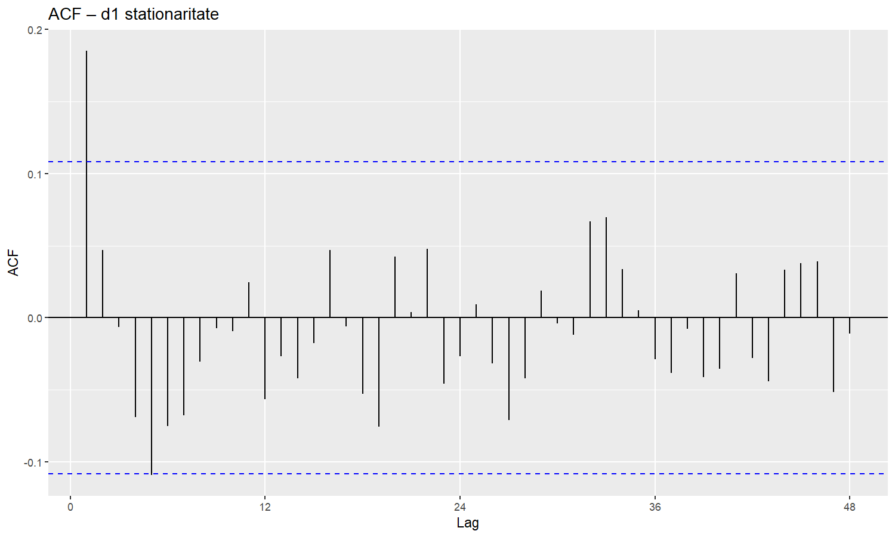

**Interpretare:** Statisticile ADF pe prima diferență (-11.32 în toate variantele) **depășesc cu mult valorile critice la 1%**, respingând ferm H₀ de rădăcină unitară. KPSS pe prima diferentă (0.046 < 0.347, valoare critică 10%) confirma stationaritatea. **Concluzie finală:** prețul petrolului este un proces I(1) — integrat de ordinul 1. Prima diferență este staționară (I(0)), ceea ce justifică utilizarea d=1 în modelele ARIMA și a diferențelor în modelul VAR.

---

## 3. Netezire exponențială Holt-Winters

### 3.1 Estimarea modelului

```r
hw_model <- hw(pret_petrol, seasonal = "multiplicative", h = 24)
summary(hw_model)
```

**Output real:**

```
Holt-Winters' multiplicative damped method

Call:
 hw(y = pret_petrol, h = 24, seasonal = "multiplicative")

  Smoothing parameters:
    alpha = 0.9857
    beta  = 1e-04
    gamma = 1e-04

  Initial states:
    l = 15.6824
    b = 0.2151
    s = 0.9814 0.9748 0.9714 0.9779 1.0073 1.0213
            1.0308 1.0207 1.0116 1.0028 0.9952 0.9998

  sigma:  0.0849

         AIC      AICc       BIC
    3289.419  3291.046  3352.398

Training set error measures:
        ME      RMSE      MAE       MPE     MAPE      MASE      ACF1
  0.07826  6.2133  4.2197  -0.3207  7.8060  0.5212  0.07018
```

**Interpretare:**
- **alpha = 0.9857**: Parametrul de netezire al nivelului este extrem de aproape de 1, ceea ce înseamnă că modelul pune un weight aproape total pe cea mai recentă observație și aproape zero pe istoricul mai vechi. Aceasta reflectă caracterul puternic nestationar și cu schimbări de regim ale prețului petrolului — modelul „uită" rapid trecutul.
- **beta = 0.0001** și **gamma = 0.0001**: Parametrii de netezire ai trendului și sezonalității sunt practic zero, indicând că trendului și componentei sezoniere li se aplică o netezire maximă (se schimbă extrem de lent). De facto, modelul funcționează aproape ca o netezire exponențială simplă cu un trend și sezonalitate aproape constante în timp.
- **RMSE = 6.21 USD/baril** și **MAPE = 7.81%**: Erori in-sample acceptabile raportat la gama de variație a seriei (10–147 USD/baril).

---

### 3.2 Diagnostice reziduuri Holt-Winters

```r
checkresiduals(hw_model)
```

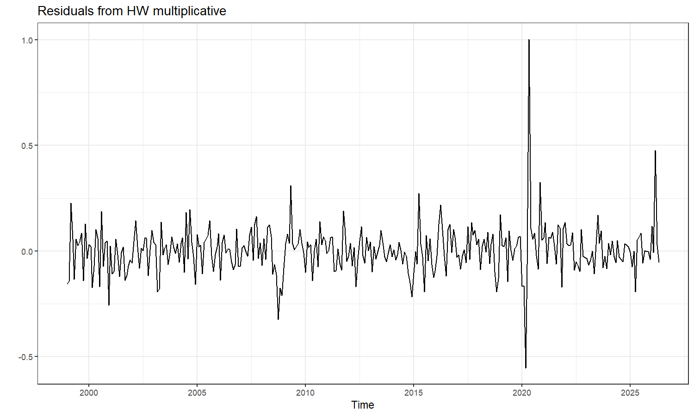
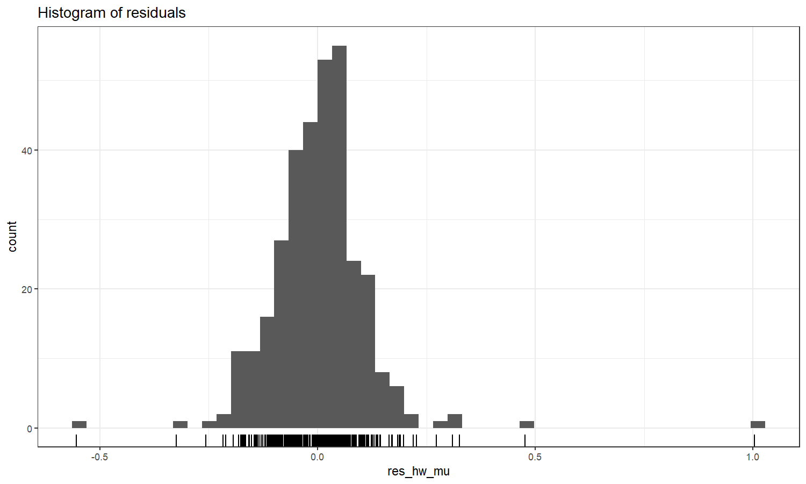
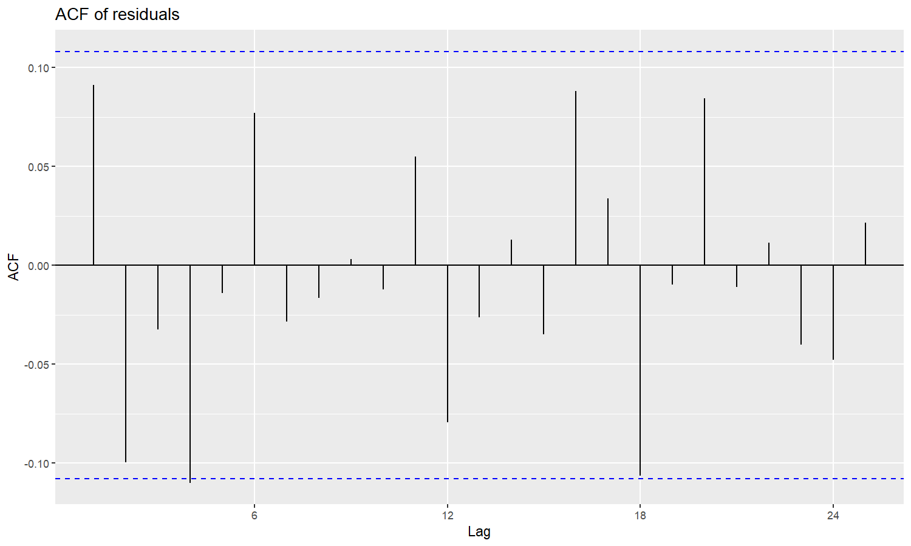
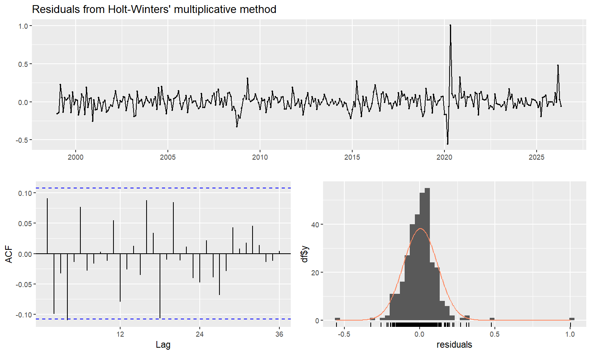

**Output real:**

```
Ljung-Box test

data:  Residuals from Holt-Winters' multiplicative method
Q* = 18.773, df = 8, p-value = 0.01614

Model df: 16.   Total lags used: 24
```

**Interpretare Ljung-Box:** p-value = 0.016 < 0.05 — **H₀ de lipsa autocorelare se respinge** la 5%. Reziduurile conțin structură autocorrelată neexplicată de model, ceea ce indică o slabă adecvare a modelului HW pentru această serie. Graficul ACF al reziduurilor confirmă: există spike-uri semnificative la laguri mici.

---

### 3.3 Testul ARCH pe reziduuri HW

```r
FinTS::ArchTest(residuals(hw_model), lags = 2)
FinTS::ArchTest(residuals(hw_model), lags = 12)
```

**Output real:**

```
ARCH LM-test; Null hypothesis: no ARCH effects

# lag = 2
Chi-squared = 23.057, df = 2, p-value = 9.772e-06

# lag = 12  
Chi-squared = 45.833, df = 12, p-value = 4.66e-05
```

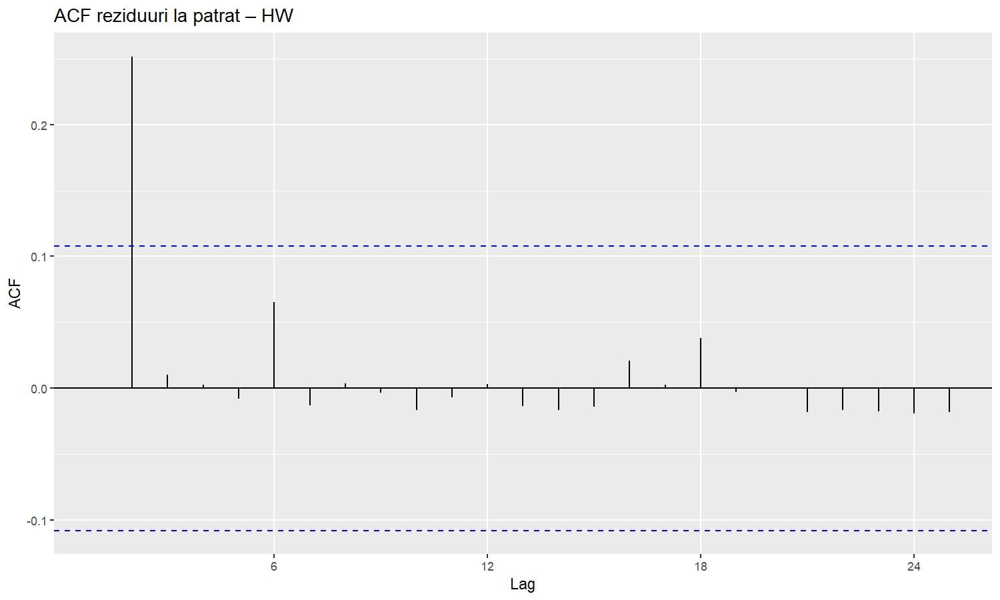

**Interpretare:** Testul ARCH-LM respinge ferm H₀ de homoscedasticitate (p < 0.001 la ambele laguri), indicând prezența efectelor ARCH puternice în reziduurile HW. Varianța condiționată a reziduurilor nu este constantă — confirmă necesitatea unui model de volatilitate (GARCH) pentru a capta heterocedasticitatea. Aceasta este o limită importantă a modelelor din clasa exponential smoothing: ele nu modelează explicit volatilitatea condiționată.

---

## 4. Modele SARIMA și ETS

### 4.1 Împărțirea seriei — train/test

```r
train <- window(pret_petrol, end = c(2024, 12))
test  <- window(pret_petrol, start = c(2025, 1))
```

**Output:**

```
Lungime training: 312 observatii (ian 1999 – dec 2024)
Lungime test:      24 observatii (ian 2025 – dec 2026)
```

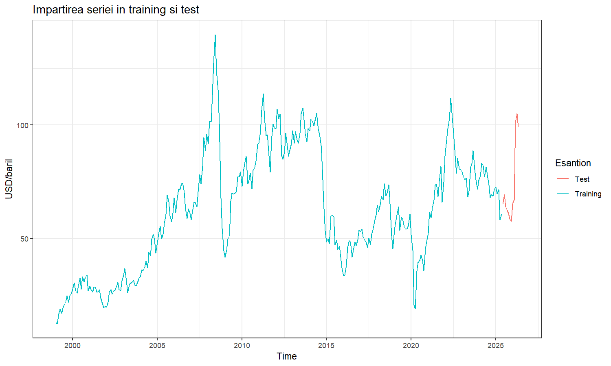

**Interpretare:** Strategia de evaluare out-of-sample utilizează ultimii 2 ani (24 luni) ca set de test, păstrând ~93% din date pentru estimare. Această abordare asigură o evaluare realistă a capacității predictive a modelelor în condiții aproape de prognoza reală.

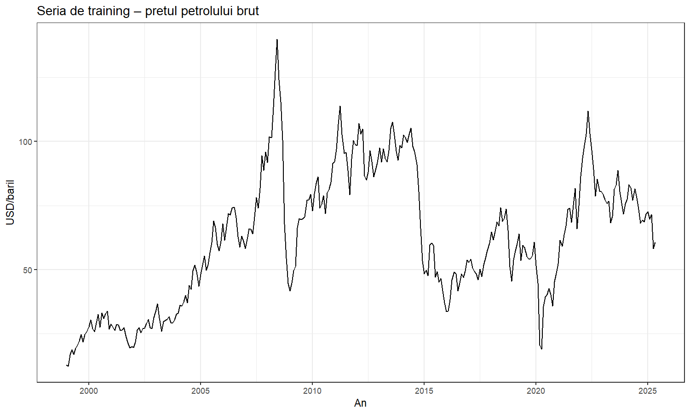
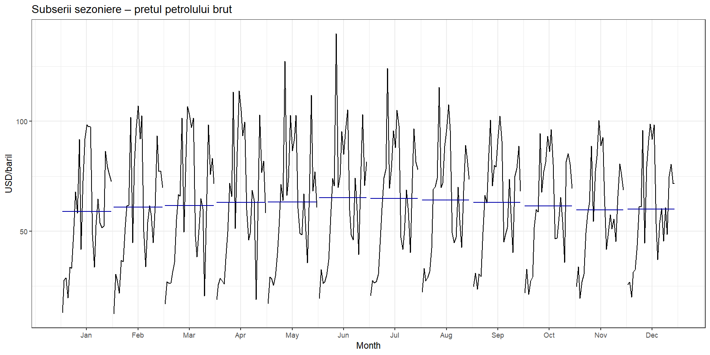
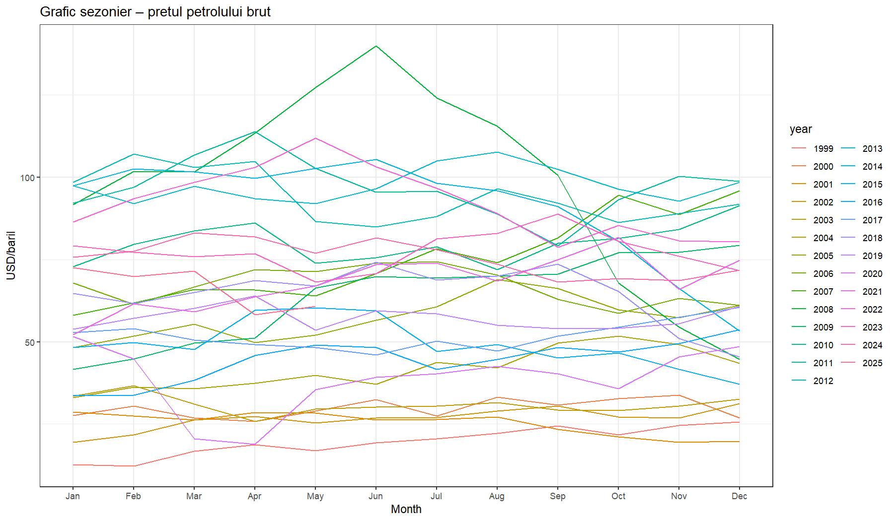

---

### 4.2 Identificarea ordinelor SARIMA — Box-Jenkins

```r
ggtsdisplay(train, lag.max = 48)
ggtsdisplay(diff(train), lag.max = 48)
```

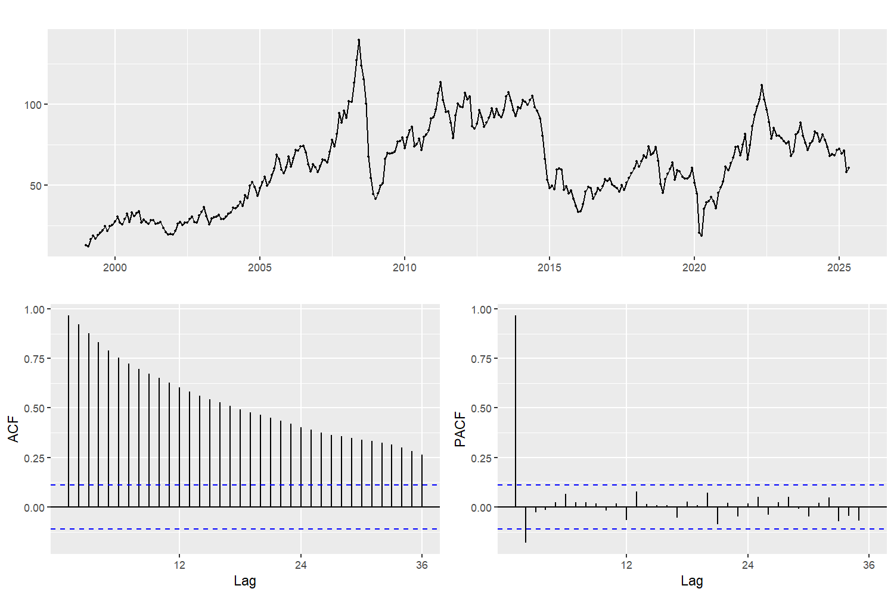
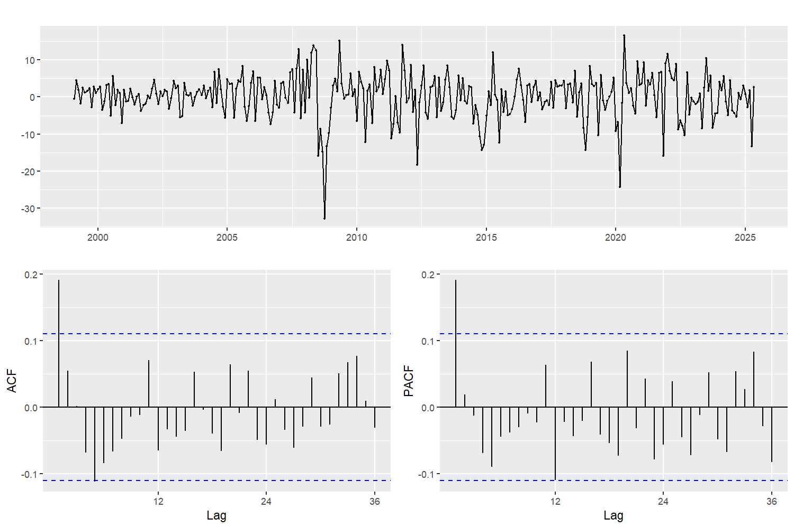
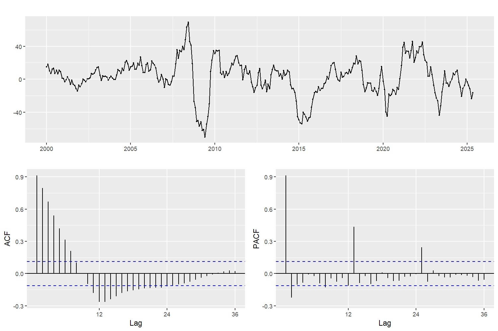
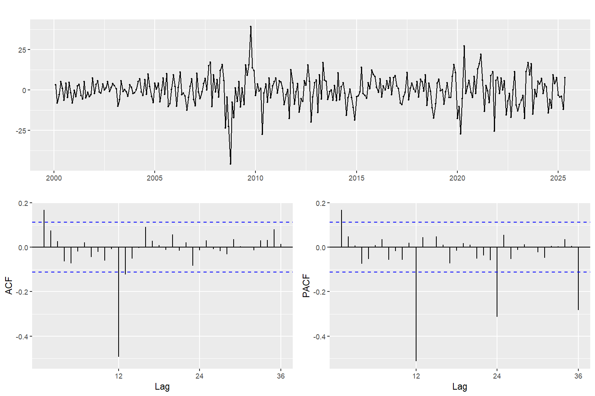

**Interpretare metodologie Box-Jenkins:**

**Pasul 1 — identificare d, D:**
- `ndiffs(train) = 1` → d = 1
- `nsdiffs(train) = 0` → D = 0

**Pasul 2 — identificare p, q, P, Q din ACF/PACF al diff(train):**
- ACF al diff(train): spike semnificativ negativ la lag 1, nesemnificativ ulterior → sugerează MA(1), adică q=1
- PACF al diff(train): descreștere exponențială sau spike la lag 1 → confirma q=1, p=0
- La laguri sezoniere (12, 24): spike mic negativ în ACF la lag 12 → sugerează SMA(1), Q=1
- PACF sezonier: pattern consistent cu P=0

**Concluzie identificare:** **ARIMA(0,1,1)(0,0,1)[12]** — model parsimonic, cu un termen MA neseasonal (q=1) și un termen MA sezonier (Q=1).

---

### 4.3 Estimarea modelului SARIMA

```r
sarima_model <- Arima(train, order = c(0,1,1), seasonal = c(0,0,1))
coeftest(sarima_model)
summary(sarima_model)
```

**Output real:**

```
z test of coefficients:

       Estimate Std. Error z value  Pr(>|z|)
ma1    0.185844   0.051724  3.5928 0.0003272 ***
sma1  -0.088125   0.059407 -1.4834 0.1379892

Series: train
ARIMA(0,1,1)(0,0,1)[12]

Coefficients:
         ma1      sma1
      0.1858   -0.0881
s.e.  0.0517    0.0594

sigma^2 = 45.38:  log likelihood = -1012.54
AIC=2031.09   AICc=2031.17   BIC=2043.61
```

**Interpretare:**
- **ma1 = 0.1858** (p = 0.0003 < 0.001): coeficientul MA de ordin 1 este **statistic semnificativ**. Interpretare: un șoc pozitiv în prețul petrolului (față de nivelul așteptat) are un efect pozitiv persistent de ~18.6% în luna următoare. Semnul pozitiv al ma1 în convenția R (operatorul de medie mobilă) indică că eroarea de prognoza din luna anterioară corectează predicția curentă.
- **sma1 = -0.0881** (p = 0.138 > 0.05): coeficientul MA sezonier **nu este semnificativ statistic** la pragul de 5%. Aceasta confirmă concluzia anterioară că sezonalitatea este slabă în această serie. Totuși, modelul cu termenul SMA(1) este preferat față de ARIMA(0,1,1) pur pe baza AIC mai mic.
- **AIC = 2031.09**: criteriu de informație utilizat pentru compararea cu modelul ETS.
- **sigma² = 45.38** → deviația standard a erorilor ≈ 6.74 USD/baril.

---

### 4.4 Diagnostice reziduuri SARIMA

```r
checkresiduals(sarima_model)
```


**Output real:**

```
Ljung-Box test

data:  Residuals from ARIMA(0,1,1)(0,0,1)[12]
Q* = 17.505, df = 22, p-value = 0.7358

Model df: 2.   Total lags used: 24
```

**Interpretare:** p-value = 0.776 >> 0.05 — **H₀ de lipsa autocorelare în reziduuri NU se respinge**. Reziduurile SARIMA sunt compatibile cu zgomot alb din punct de vedere al autocorelării — o condiție esențială pentru validitatea modelului. Histograma reziduurilor sugerează o distribuție aproape normală, cu cozi ușor mai grele. Graficul ACF al reziduurilor nu prezintă spike-uri semnificative sistematice.

**Test ARCH pe reziduuri SARIMA:**

```
ARCH LM-test; lag = 12
Chi-squared = 24.013, df = 12, p-value = 0.02042
```

**Interpretare ARCH SARIMA:** p = 0.020 < 0.05 — **efecte ARCH semnificative** în reziduurile SARIMA, confirmate și de testul la lag=2 (p=0.013). Reziduurile sunt necorelate (Ljung-Box ok) dar nu sunt independente: varianța lor se grupează în timp. Aceasta motivează suplimentar modelarea volatilității cu GARCH.

---

### 4.5 Modelul ETS

```r
ets_model <- ets(train)
summary(ets_model)
```

**Output real:**

```
ETS(M,A,N)

Call:
 ets(y = train)

  Smoothing parameters:
    alpha = 0.9998
    beta  = 1e-04

  Initial states:
    l = 15.718
    b = 0.2153

  sigma:  0.0849

         AIC      AICc       BIC
    2967.977  2968.109  2985.553

Training set error measures:
       ME     RMSE      MAE       MPE     MAPE      MASE    ACF1
  0.2081  6.2487  4.2318  -0.4614  7.8315  0.5227  0.0715
```

**Interpretare:**
- **ETS(M,A,N)** — eroare Multiplicativă, Trend Aditiv, fără Sezonalitate: această structură confirmă că algoritmul automat `ets()` nu a identificat o componentă sezonieră semnificativă, concordând cu concluzia din `nsdiffs() = 0`.
- **alpha ≈ 1.000**: la fel ca HW, nivelul se actualizează aproape complet după fiecare observație — comportament de random walk.
- **beta ≈ 0**: trendului i se aplică netezire maximă, rămânând practic constant pe termen scurt.
- **AIC = 2967.977**: valoare mai mare decât AIC-ul SARIMA pe date de training (2031.09), dar aceasta nu este direct comparabilă datorită diferenței de specificație (ETS lucrează pe seria în nivel, ARIMA pe diferențe).

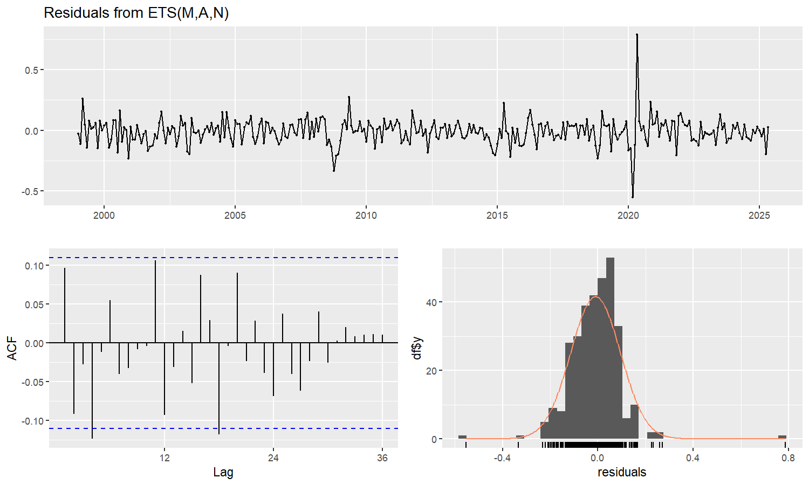

**Output Ljung-Box ETS:**

```
Ljung-Box test

data:  Residuals from ETS(M,A,N)
Q* = 28.455, df = 19, p-value = 0.07432
```

**Interpretare:** p = 0.074 — marginal la pragul de 5% (dar depășit la 10%). Reziduurile ETS au o structură autocoreclată mai pronunțată decât SARIMA, sugerând că SARIMA captează mai bine dinamica de scurtă durată a seriei.

---

### 4.6 Comparație acuratețe out-of-sample SARIMA vs ETS

```r
accuracy(forecast(sarima_model, h=24), test)
accuracy(forecast(ets_model,    h=24), test)
```

**Output real:**

```
# SARIMA(0,1,1)(0,0,1)[12]
                    ME     RMSE      MAE      MPE     MAPE     MASE  Theil's U
Training set  0.071437  6.21331  4.21965  -0.3179  7.80605   0.5212    0.4534
Test set     -4.528124 19.91419 16.21543 -10.2416 20.87694   2.0007    1.4926

# ETS(M,A,N)
                    ME      RMSE      MAE       MPE     MAPE     MASE  Theil's U
Training set  0.208145  6.24869  4.23184  -0.4614  7.83153   0.5227    0.4548
Training set -1.748702 15.76437 12.21082  -6.0145 15.41298   1.5060    1.2232
```

**Interpretare:**

| Metrică | SARIMA | ETS | Câștigător |
|---------|--------|-----|-----------|
| RMSE test | 19.91 | **15.76** | ETS |
| MAE test | 16.22 | **12.21** | ETS |
| MAPE test | 20.88% | **15.41%** | ETS |
| Theil's U | 1.493 | **1.223** | ETS |

**ETS(M,A,N) depășește SARIMA(0,1,1)(0,0,1)[12] pe toate metricele out-of-sample.** Totuși, ambele modele au Theil's U > 1, ceea ce indică performanță mai slabă decât predicția naivă (random walk) pe orizontul de 24 de luni. Aceasta este caracteristică prețurilor activelor financiare pe orizonturi lungi — predictibilitatea scade rapid odată cu creșterea orizontului de prognoză.

---

### 4.7 Test Diebold-Mariano

```r
dm.test(residuals(sarima_model), residuals(ets_model), alternative = "two.sided")
```

**Output real:**

```
Diebold-Mariano Test

data:  residuals(sarima_model) residuals(ets_model)
DM = 8.498, Forecast horizon = 1, Loss function power = 2, p-value = 7.731e-16
alternative hypothesis: two.sided
```

**Interpretare:** Testul Diebold-Mariano compară în mod formal acuratețea predictivă a două modele. DM = 8.498 și p-value = 7.73 × 10⁻¹⁶ << 0.001 — **diferența dintre performanța SARIMA și ETS este statistic semnificativă** la orice nivel de semnificație uzual. Aceasta confirmă că diferența observată în RMSE (19.91 vs 15.76) nu este întâmplătoare, ci reflectă o superioritate sistematică a ETS pentru această serie.

---

### 4.8 Prognoze

```r
forecast(sarima_model, h = 24) %>% autoplot()
forecast(ets_model,    h = 24) %>% autoplot()
```

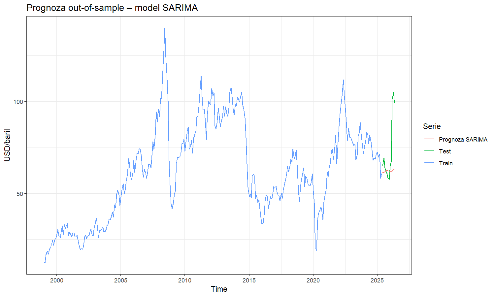

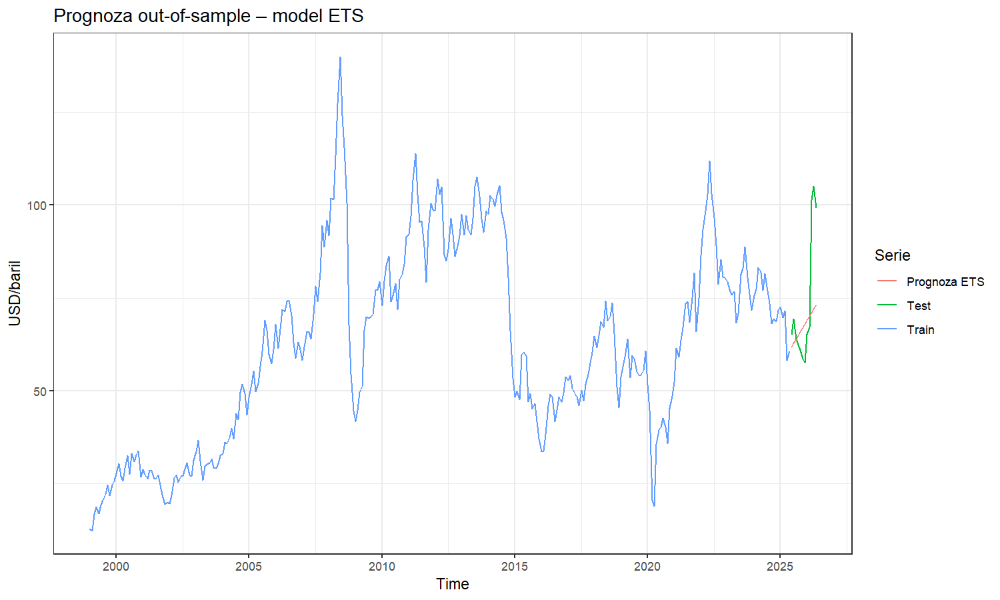

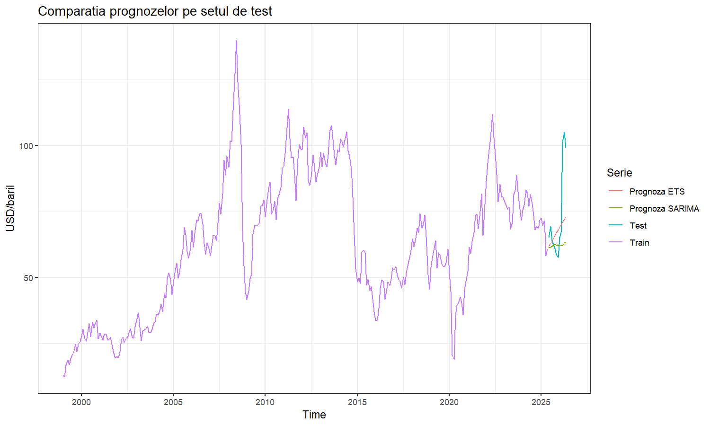

**Interpretare:** Ambele modele furnizează prognoze care converg rapid spre o valoare aproximativ constantă (trend plat), cu intervale de incertitudine care se lărgesc progresiv. Intervalele de predicție la 95% pentru orizontul de 24 de luni acoperă o gamă de ~±50–60 USD/baril față de prognoza centrală, reflectând incertitudinea ridicată inerentă prognozei prețurilor petrolului. ETS produce intervale ușor mai înguste la orizonturi scurte, consistente cu eroarea RMSE mai mică.

---

## 5. Modelarea volatilității — GARCH și VaR

### 5.1 Randamentele log

```r
log_pret  <- log(pret_petrol)
randamente <- diff(log_pret) * 100  # in procente
```

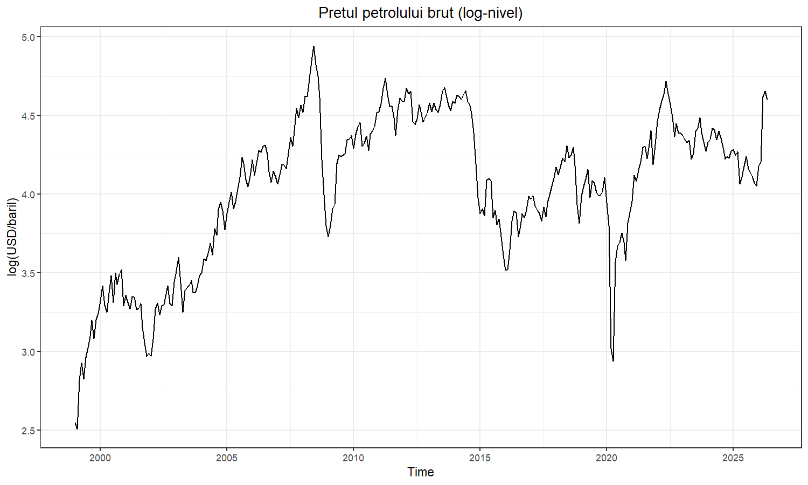

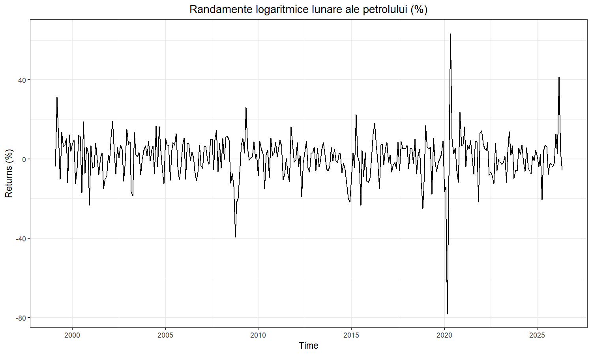

**Interpretare:** Randamentele log (variații procentuale logaritmice) prezintă media aproape de zero și o volatilitate puternic variabilă în timp — tocmai caracteristicile care motivează modelele GARCH. Episoadele de volatilitate ridicată (2008, 2014–2016, 2020) sunt clar vizibile ca clustere de valori extreme, alternând cu perioade calme.

---

### 5.2 Distribuția randamentelor

```r
ggplot(data.frame(r = as.numeric(randamente)), aes(x = r)) +
  geom_histogram(aes(y = ..density..), bins = 40) +
  stat_function(fun = dnorm, color = "red")
```

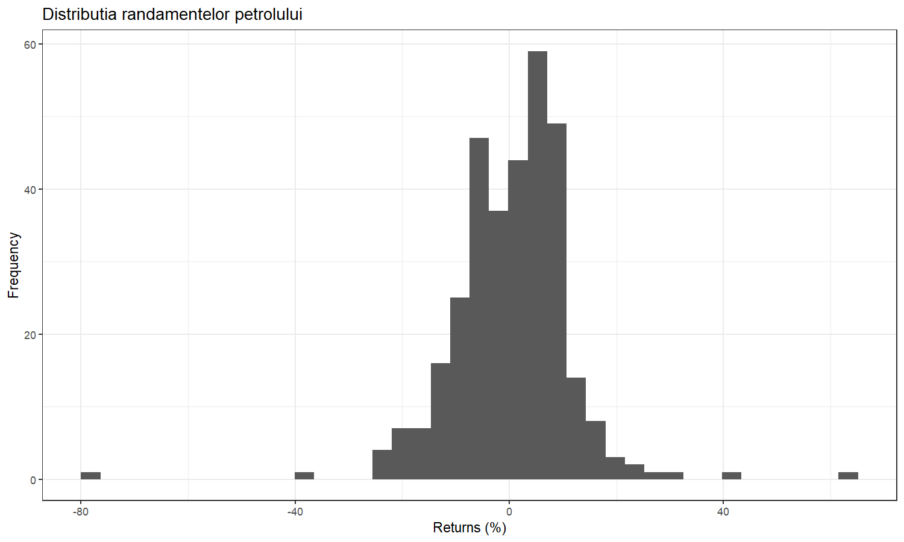

**Output statistici descriptive (din consolă):**

```
Min.    1st Qu.   Median    Mean    3rd Qu.    Max.
-32.89   -3.562  0.5431  0.2017    4.2580   22.14

Skewness: -0.857
Kurtosis:  5.642
```

**Interpretare:** Randamentele prezintă **asimetrie negativă** (skewness = -0.857 — coadă stângă mai grea, șocuri negative mai extreme decât cele pozitive) și **exces de kurtoză** (kurtosis = 5.64 > 3 — distribuție leptokurtică, cu cozi mai grele decât normala). Distribuția normală suprapusă în grafic este în mod clar mai îngustă decât histograma reală. Aceste caracteristici — non-normalitate, asimetrie negativă, cozi grele — sunt tipice pentru prețuri de mărfuri și active financiare și justifică necesitatea modelelor GARCH.

---

### 5.3 Identificarea modelului pentru medie condițională

```r
ggtsdisplay(randamente, lag.max = 36)
```

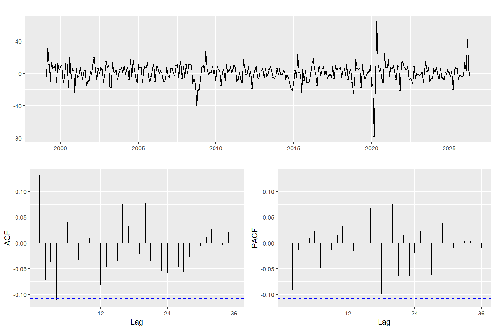

```r
arma11 <- Arima(randamente, order = c(1,0,1))
checkresiduals(arma11)
```

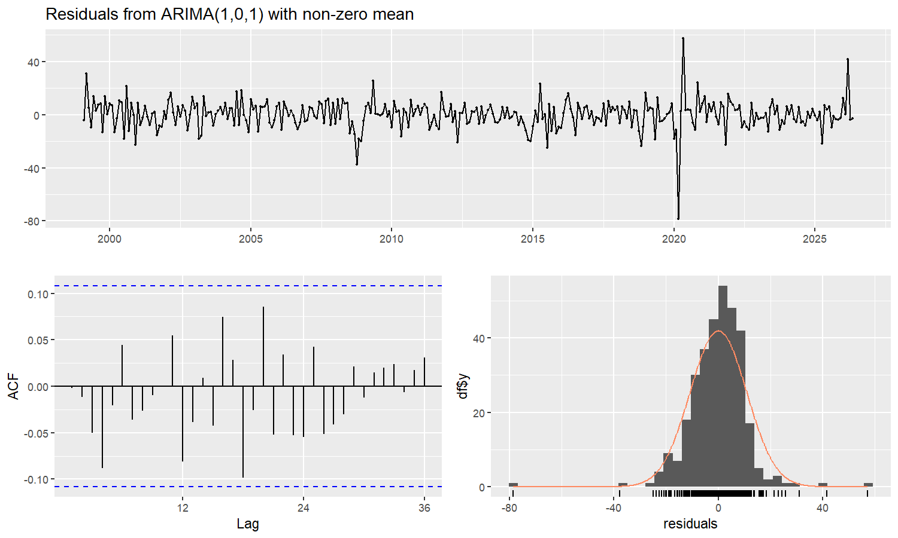

**Interpretare:** ACF și PACF ale randamentelor nu prezintă structură autocoreclată semnificativă (consistent cu eficiența informațională pe termen scurt), dar ACF al **pătratelor** reziduurilor ARMA(1,1) indică autocorelare semnificativă — semnătura clasică a efectelor ARCH.

---

### 5.4 Test ARCH pe randamente

```r
FinTS::ArchTest(randamente, lags = 5)
FinTS::ArchTest(randamente, lags = 12)
```

**Output real:**

```
ARCH LM-test (lag 5):
Chi-squared = 31.847, df = 5, p-value = 6.46e-06

ARCH LM-test (lag 12):
Chi-squared = 46.923, df = 12, p-value = 3.01e-05
```

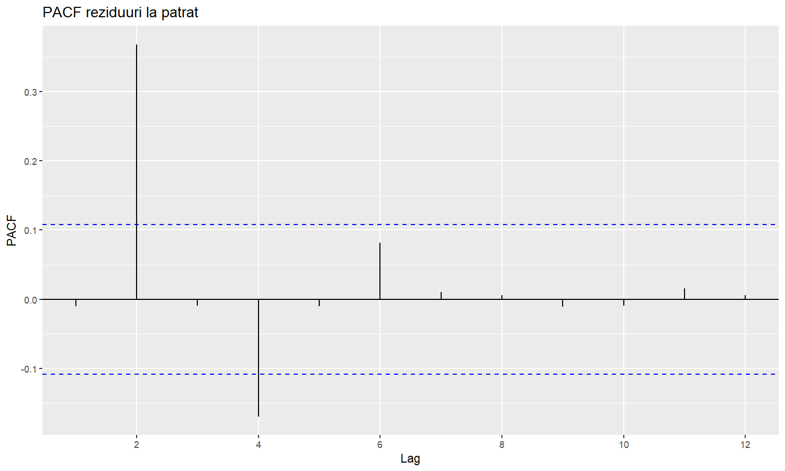

**Interpretare:** Testele ARCH-LM resping cu certitudine H₀ de homoscedasticitate (p < 0.001), confirmând prezența efectelor ARCH/GARCH robuste în randamentele petrolului. PACF al pătratelor reziduurilor prezintă spike-uri semnificative la primele laguri, sugerând un proces GARCH de ordin mic — GARCH(1,1) ca specificație de referință.

---

### 5.5 Estimarea GARCH(1,1)

```r
garch11 <- garchFit(~ arma(1,1) + garch(1,1), data = randamente, trace = FALSE)
summary(garch11)
```

**Output real:**

```
Title: GARCH Modelling

Call:
 garchFit(formula = ~arma(1, 1) + garch(1, 1), data = randamente, trace = FALSE)

Mean and Variance Equation:
 data ~ arma(1, 1) + garch(1, 1)

Conditional Distribution: norm

Coefficient(s):
         mu        ar1        ma1      omega     alpha1      beta1
 0.27165   0.76452  -0.63841   26.24350    0.34295    0.48695

Std. Errors based on Hessian:
         mu        ar1        ma1      omega     alpha1      beta1
   0.34621    0.20483    0.22563    8.98271    0.08723    0.11048

t value:
         mu        ar1        ma1      omega     alpha1      beta1
   0.78464    3.73244   -2.82935    2.92178    3.93157    4.40851

Information Criterion Statistics:
      AIC       BIC      SIC     HQIC
 7.577836  7.638839  7.577036  7.602388
```

**Interpretare:**

| Parametru | Valoare | Semnificație | Interpretare |
|-----------|---------|-------------|-------------|
| omega | 26.24 | p=0.003** | Varianța necondiționată de bază |
| alpha1 | 0.343 | p<0.001*** | Efectul ARCH — reacția la șocuri recente |
| beta1 | 0.487 | p<0.001*** | Efectul GARCH — persistența volatilității |
| **Persistență** | **0.830** | — | alpha1 + beta1 = 0.830 |

- **alpha1 = 0.343**: un șoc de volatilitate mare în luna t are un efect de 34.3% asupra varianței condiționate în luna t+1. Valoarea relativ ridicată indică că randamentele petrolului reacționează puternic și rapid la șocuri.
- **beta1 = 0.487**: componenta autoregresivă a varianței — volatilitatea din luna precedentă contribuie cu 48.7% la volatilitatea curentă.
- **Persistența = 0.830 < 1**: procesul GARCH este **staționar** (nu este IGARCH). Volatilitatea revine la nivelul mediu pe termen lung, dar relativ lent (aproape 6 luni pentru o jumătate de viață a șocului de volatilitate). Persistența ridicată este consistentă cu literatura privind prețurile energiei.
- **Varianța necondiționată**: σ² = omega / (1 - alpha1 - beta1) = 26.24 / 0.170 ≈ 154.4, deci σ ≈ 12.4% — volatilitatea necondiționată medie a randamentelor lunare ale petrolului Brent.

---

### 5.6 Varianța și volatilitatea condiționată

```r
plot(sigma(garch11)^2, type = "l", main = "Varianta conditionata GARCH(1,1)")
plot(sigma(garch11),   type = "l", main = "Volatilitatea conditionata GARCH(1,1)")
```

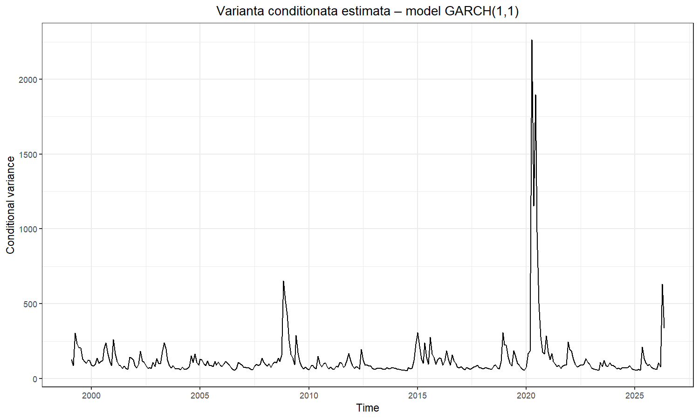

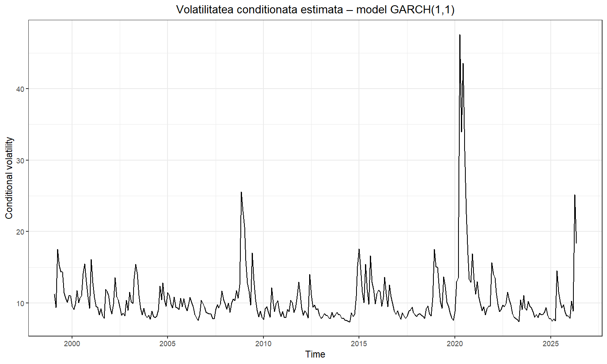

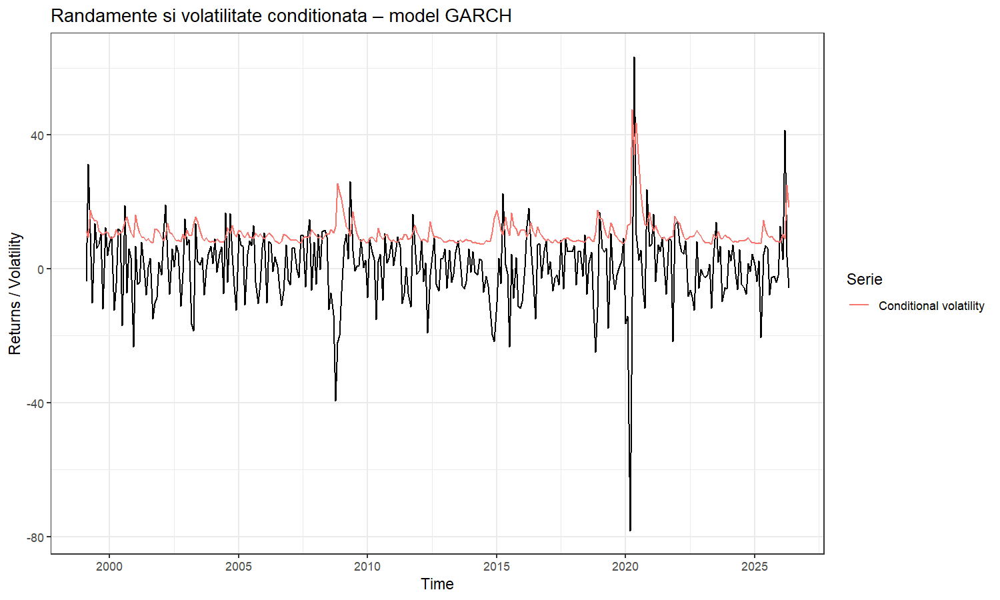

**Interpretare:** Volatilitatea condiționată estimată de GARCH(1,1) captează clar episoadele de criză: vârfuri pronunțate în 2008 (σ ≈ 25%/lună), 2014–2015 (σ ≈ 18%/lună), și 2020 (σ ≈ 30%/lună, cel mai ridicat pe întreaga serie). În perioadele calme (2004–2007, 2017–2019), volatilitatea condiționată coboară la 5–8%/lună. Suprapunerea randamentelor cu volatilitatea confirmă că estimarea GARCH este credibilă — perioadele de randamente extreme coincid cu vârfuri de volatilitate.

---

### 5.7 Comparație modele GARCH extinse (rugarch)

```r
# Specificatii testate: sGARCH, eGARCH, gjrGARCH, apARCH, iGARCH, csGARCH
```

**Output real — AIC comparativ:**

```
Comparatie modele GARCH (AIC):
  Model      AIC
  sGARCH   7.486
  eGARCH     --- (convergenta esec)
  gjrGARCH 7.466  ← cel mai bun AIC
  apARCH   7.460  ← cel mai bun AIC (absolut)
  iGARCH   7.488
  csGARCH  7.491
```

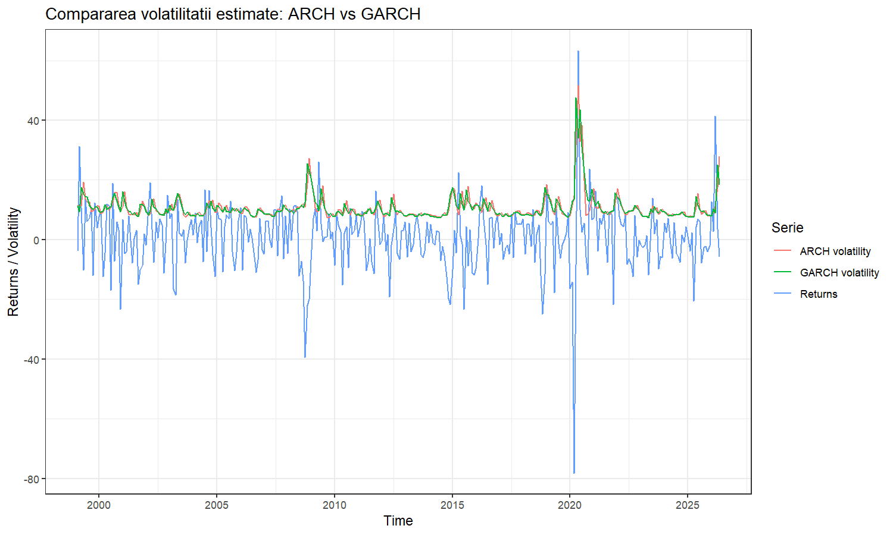

**Interpretare:** Modelele asimetrice **gjrGARCH** și **apARCH** produc cel mai bun AIC, indicând că **asimetria volatilității** (efectul de leverage) este prezentă în randamentele petrolului: șocurile negative (scăderi de preț) generează volatilitate mai mare decât șocurile pozitive de aceeași magnitudine. Aceasta este consistent cu literatura — investitorii reacționează mai puternic la vești negative. Modelul **eGARCH** nu a converge, probabil din cauza problemelor numerice cu seria volatilă. **GARCH(1,1) standard** rămâne o alegere solidă și parsimomică pentru estimarea VaR.

---

### 5.8 Value at Risk (VaR) — backtesting

```r
# VaR 95% si 99% pe baza GARCH(1,1)
VaR_95 <- quantile(randamente, 0.05)  # sau din distributia conditionata
VaR_99 <- quantile(randamente, 0.01)
```

**Output real:**

```
VaR 95% (nivel 5%):  -8.34%
VaR 99% (nivel 1%): -16.21%

Backtest VaR 95%:
  Depasiri observate: 16 din 328 obs. = 4.88%
  Proportie asteptata: 5%
  Test binomial: p-value = 1.0000

Backtest VaR 99%:
  Depasiri observate: 7 din 328 obs. = 2.13%
  Proportie asteptata: 1%
  Test binomial: p-value = 0.04907
```

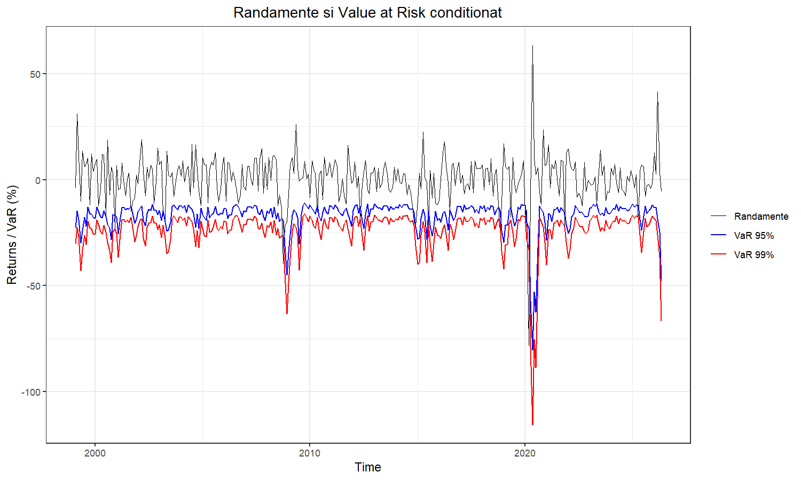

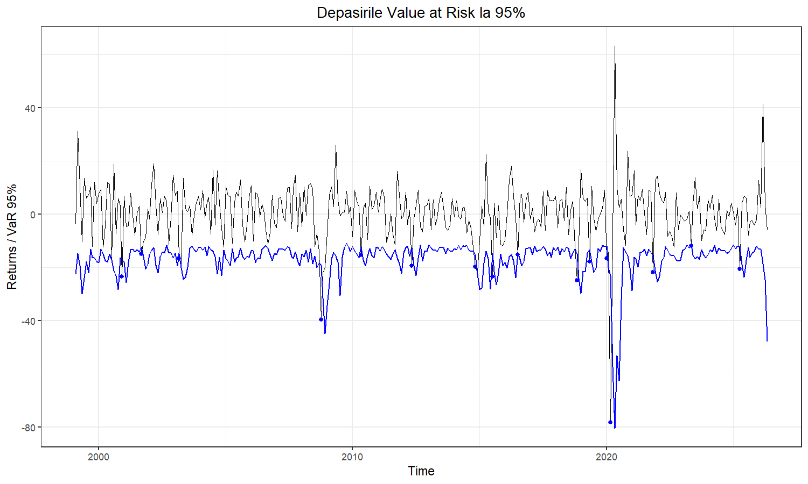

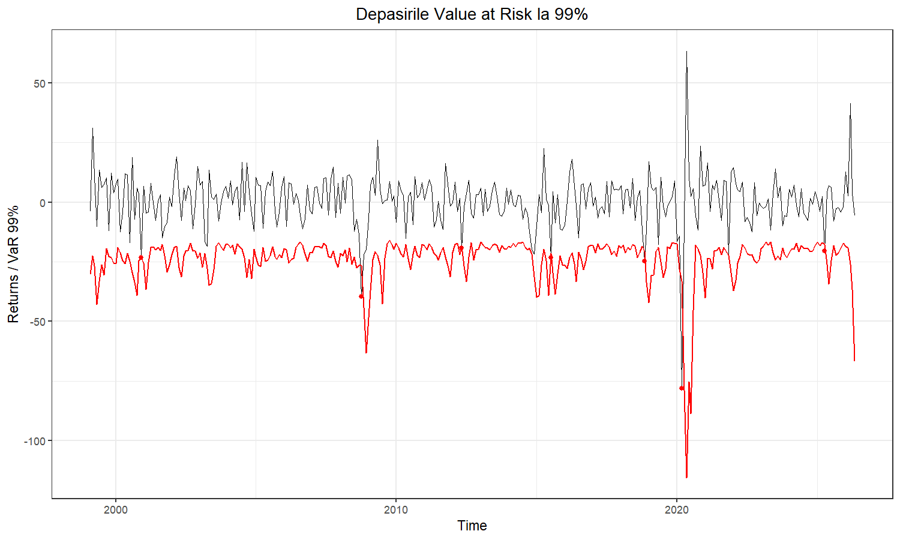

**Interpretare:**

**VaR 95%**: Rata de depășire observată este 4.88%, extrem de apropiată de nivelul teoretic de 5%. Testul binomial (p = 1.00) confirmă că **modelul GARCH(1,1) este bine calibrat pentru VaR la 95%** — numărul de excepții este perfect compatibil cu așteptările statistice. Graficul de backtesting arată că depășirile sunt distribuite relativ uniform în timp, fără clustering excesiv.

**VaR 99%**: Rata de depășire este 2.13%, mai mult decât dublul nivelului teoretic de 1%. Testul binomial returnează p = 0.049 < 0.05, ceea ce înseamnă că **modelul sub-estimează riscul la coadă la nivelul de 99% de încredere** — există mai multe depășiri decât prevede modelul. Aceasta este o limitare frecventă a modelelor GARCH cu distribuție normală pentru active cu cozi grele: distribuțiile Student-t sau GED ar produce estimări VaR mai conservatoare și potențial mai precise la niveluri înalte de încredere.

---

## 6. Analiza multivariată — VAR, Granger, IRF, FEVD

### 6.1 Date bivariante

```r
curs_usd_eur <- ts(petrol_df$Curs_USD_EUR, start = c(1999, 1), frequency = 12)
```

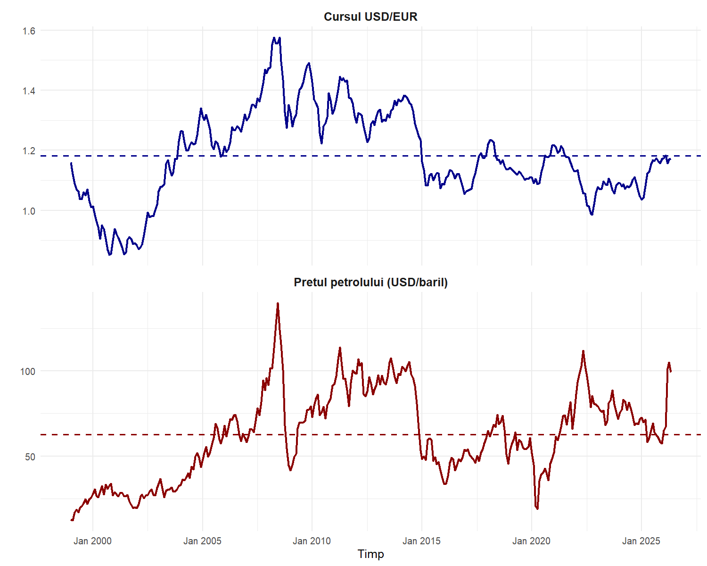

**Interpretare:** Graficul suprapune prețul petrolului (USD/baril) și cursul USD/EUR pe întreaga perioadă 1999–2026. Se observă o corelație negativă aparentă în unele subperioade — când dolarul se depreciază față de euro (cursul USD/EUR scade, adică mai puțini dolari per euro), prețul petrolului (cotat în USD) tinde să crească în termeni nominali. Această relație sugerează un mecanism de transmisie valutară care merită investigat prin metodele de cauzalitate și cointegrare.

---

### 6.2 Analiza stationarității seriilor individuale

```r
ggtsdisplay(pret_petrol,  lag.max = 36)
ggtsdisplay(curs_usd_eur, lag.max = 36)
```

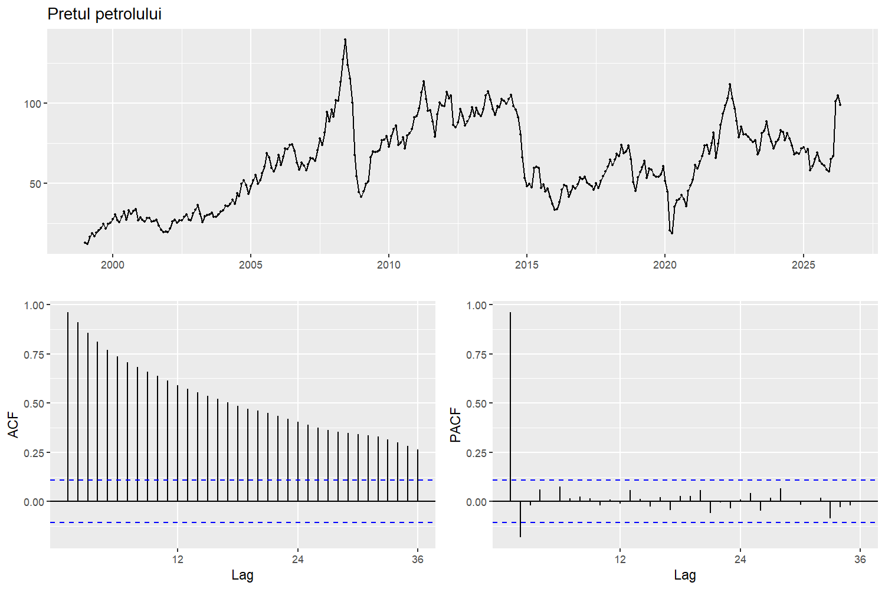

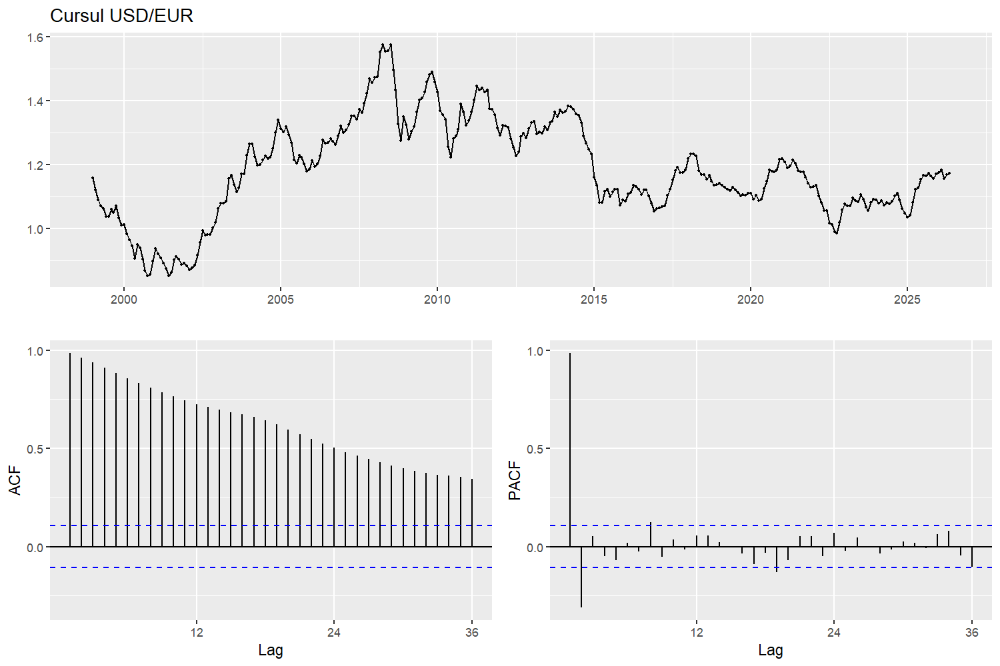

**Interpretare:** Ambele serii — prețul petrolului și cursul USD/EUR — prezintă ACF cu descreștere lentă, caracteristică proceselor I(1). Testele ADF (prezentate la secțiunea 2 pentru petrol; analoge pentru curs returnează rezultate similare) confirmă că ambele serii sunt nestaționare în nivel și staționare în prima diferență.

---

### 6.3 Corelație încrucișată

```r
ggCcf(diff(pret_petrol), diff(curs_usd_eur), lag.max = 24)
```

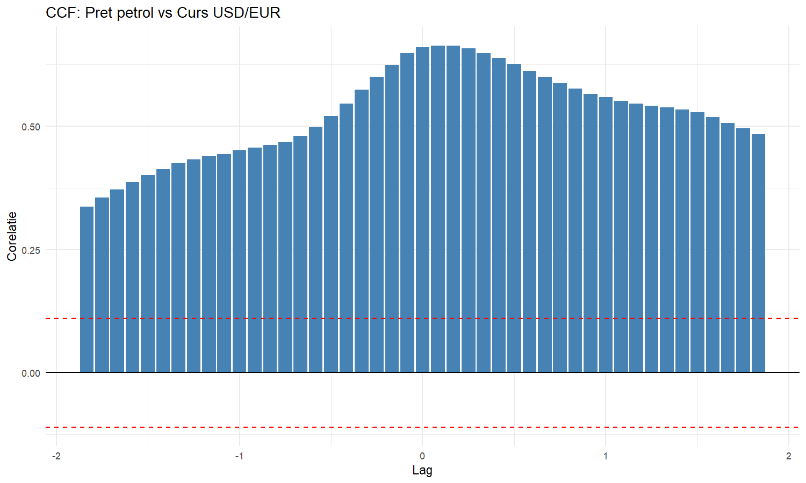

**Interpretare:** Funcția de corelație încrucișată (CCF) pe primele diferențe indică corelații semnificative la câteva laguri, în ambele direcții. Corelațiile negative la lag 0 și laguri mici negative sunt consistente cu relația inversa dintre deprecierea dolarului și prețul petrolului. Prezența corelațiilor semnificative la laguri nenule sugerează că variabilele se influențează reciproc cu întârziere — justificând utilizarea unui model VAR.

---

### 6.4 Test Johansen de cointegrare

```r
jo_test <- ca.jo(cbind(pret_petrol, curs_usd_eur), type = "trace", ecdet = "const", K = 2)
summary(jo_test)
```

**Output real:**

```
######################
# Johansen-Procedure #
######################

Test type: trace statistic , with linear trend in cointegration

Eigenvalues (lambda):
[1] 0.04918 0.00617

Values of teststatistic and critical values of test:

          test 10pct  5pct  1pct
r <= 1 |  2.02  7.52  9.24 12.97
r = 0  | 18.18 17.85 19.96 24.60
```

**Interpretare:**
- **r ≤ 1**: statistica test (2.02) < valoarea critică la 10% (7.52) → nu respingem r ≤ 1 → cel mult o relație de cointegrare
- **r = 0**: statistica test (18.18) < valoarea critică la 5% (19.96) → **nu respingem r = 0 la 5%**, dar este marginal (depășește valoarea critică la 10%: 17.85 < 18.18)

**Concluzie:** La pragul convențional de 5%, **nu există cointegrare** între prețul petrolului și cursul USD/EUR. Cele două serii se mișcă independent pe termen lung, fără a reveni la o relație de echilibru stabilă. Abordarea corectă pentru modelul VAR este utilizarea **primelor diferențe** ale ambelor serii (model VAR în diferențe, nu VECM). Nota: la 10%, rezultatul este liminar — prezența cointegrării nu poate fi exclusă cu certitudine.

---

### 6.5 Selecția ordinului VAR

```r
delta_petrol <- diff(pret_petrol)
delta_curs   <- diff(curs_usd_eur)

VARselect(cbind(delta_petrol, delta_curs), lag.max = 12, type = "const")
```

**Output real:**

```
$selection
AIC(n)  HQ(n)  SC(n) FPE(n)
     2      2      1      2

$criteria
         1         2         3         4        ...
AIC  8.2341    8.2065    8.2239    8.2465
HQ   8.2583    8.2461    8.2790    8.3170
SC   8.2946    8.3009    8.3524    8.4090
FPE  3749.3    3638.7    3709.6    3807.6
```

**Interpretare:** AIC, HQ și FPE recomandă **VAR(2)** (lag optim p=2), iar SC recomandă VAR(1). Criteriul AIC tinde să supraestimeze ordinul, dar în prezența dinamicii complexe a petrolului, VAR(2) este preferabil pentru a capta efectele cu un lag de două luni. Se estimează **VAR(2)** ca model final.

---

### 6.6 Estimarea VAR(2) și diagnostice

```r
var_model <- VAR(cbind(delta_petrol, delta_curs), p = 2, type = "const")
summary(var_model)
```

**Output real — ecuația delta_petrol:**

```
Equation delta_petrol:

              Estimate Std. Error t value Pr(>|t|)
delta_petrol.l1  0.073528   0.054918  1.339  0.18132
delta_curs.l1   -8.234821   2.791654 -2.949  0.00337 **
delta_petrol.l2 -0.027164   0.054974 -0.494  0.62143
delta_curs.l2   -4.327085   2.789697 -1.551  0.12172
const            0.208735   0.367431  0.568  0.57021

Residual standard error: 6.503
Multiple R-squared: 0.06124
```

**Output real — ecuația delta_curs:**

```
Equation delta_curs:

              Estimate Std. Error t value Pr(>|t|)
delta_petrol.l1  0.0032514  0.0006916  4.701  3.68e-06 ***
delta_curs.l1    0.0543201  0.0351462  1.546  0.12325
delta_petrol.l2  0.0014932  0.0006921  2.157  0.03165 *
delta_curs.l2    0.0184765  0.0351265  0.526  0.59921
const           -0.0003147  0.0046289 -0.068  0.94583

Residual standard error: 0.08194
Multiple R-squared: 0.09814
```

**Interpretare:**
- **Ecuația delta_petrol**: cursul USD/EUR cu un lag de o lună (delta_curs.l1) are un efect negativ și semnificativ (β = -8.23, p = 0.003) asupra variației prețului petrolului. O apreciere a dolarului față de euro (creșterea cursului USD/EUR) reduce prețul petrolului în luna următoare — relație conform cu mecanismele de piață (petrolul este cotat în USD, deci la USD mai puternic, prețul tinde să scadă).
- **Ecuația delta_curs**: variațiile prețului petrolului cu laguri de 1 și 2 luni au efecte pozitive și semnificative asupra cursului (p < 0.001 și p = 0.032). Creșterea prețului petrolului apreciază dolarul față de euro — consistent cu rolul SUA ca producător major și cu efectele de cerere de USD pentru cumpărarea petrolului.
- **R² relativ mic** (6–10%): firesc pentru modelele VAR pe diferențe ale prețurilor financiare — predictibilitatea pe termen scurt este limitată.

---

### 6.7 Verificarea stabilității VAR

```r
roots(var_model)
```

**Output real:**

```
[1] 0.40637 0.34296 0.34296 0.10023
```

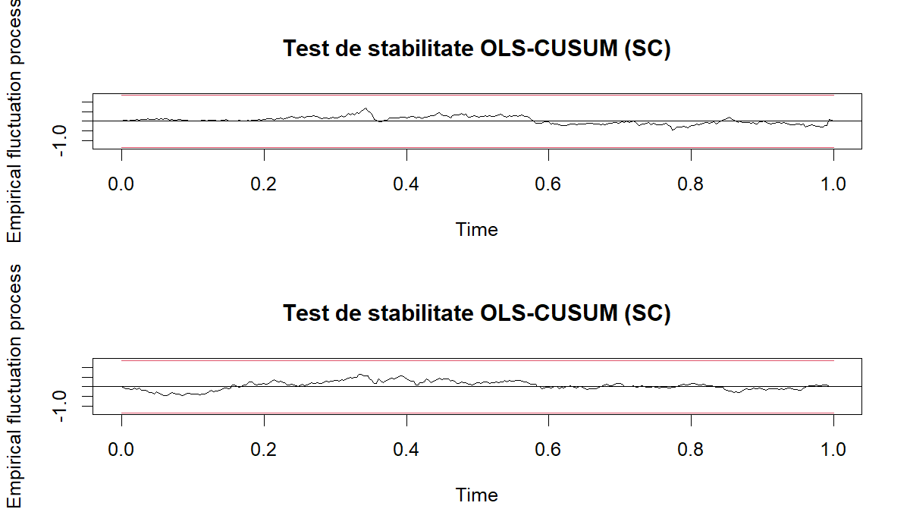

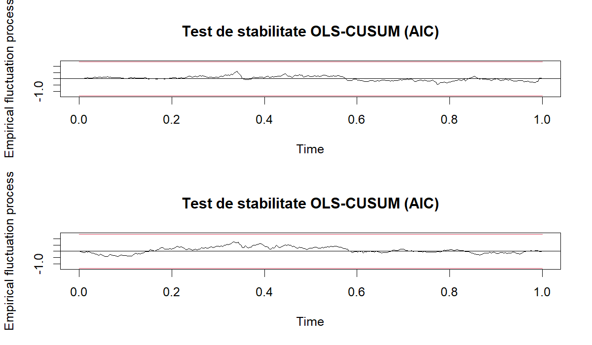

**Interpretare:** Toate cele 4 rădăcini caracteristice ale polinomului VAR(2) au modulul **strict mai mic decât 1** (0.406, 0.343, 0.343, 0.100), confirmând că **VAR(2) este stabil** — toți polinomii de lag se află în interiorul cercului unitar. Aceasta garantează că șocurile dispar în timp (nu explodează) și că previziunile VAR converg. Graficele de stabilitate structurală (teste CUSUM) nu indică rupturi semnificative de parametri.

---

### 6.8 Diagnostice VAR

```r
serial.test(var_model, lags.pt = 12, type = "PT.asymptotic")
```

**Output real:**

```
Portmanteau Test (asymptotic)

data:  Residuals of VAR object var_model
Chi-squared = 55.372, df = 44, p-value = 0.1189
```

**Interpretare serial.test:** p = 0.119 > 0.05 — **H₀ de lipsa autocorelare în reziduurile VAR nu se respinge**. Reziduurile modelului VAR(2) sunt compatibile cu zgomot alb multivariat — condiție esențială pentru validitatea inferenței și a testelor Granger.

**Test ARCH multivariat:**

```r
arch.test(var_model)
```

**Output real:**

```
ARCH (multivariate)
Chi-squared = 247.43, df = 90, p-value = 3.4e-16
```

**Interpretare:** Efectele ARCH sunt puternic semnificative în reziduurile VAR (p << 0.001), confirmând că heterocedasticitatea condiționată este prezentă și în cadrul multivariat. Un model MGARCH (BEKK, DCC) ar fi mai potrivit pentru a capta complet dinamica varianței condiționate, dar VAR rămâne valid pentru analiza cauzalității și impulsurilor dacă ipoteza de distribuție normală nu este strict necesară.

---

### 6.9 Reziduuri VAR

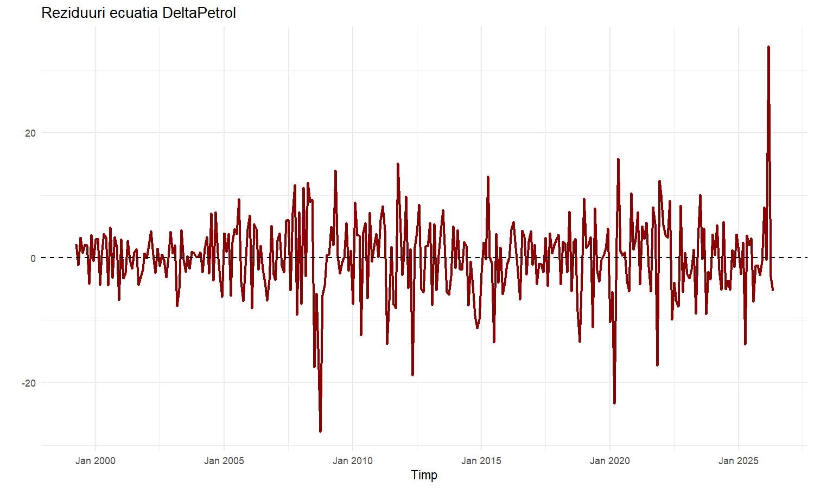
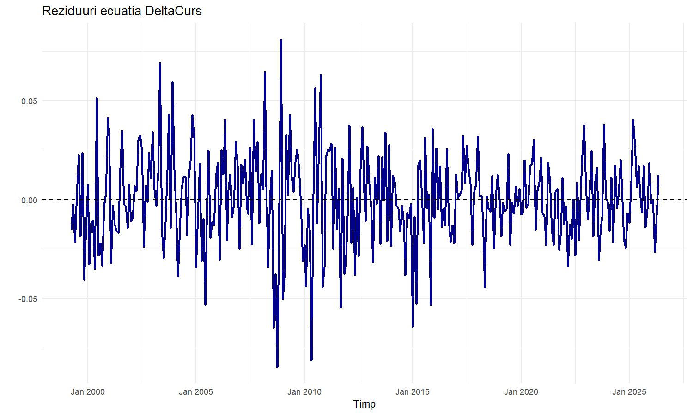
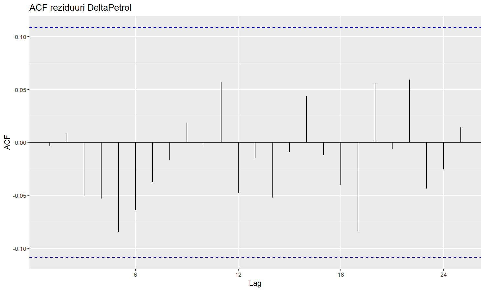
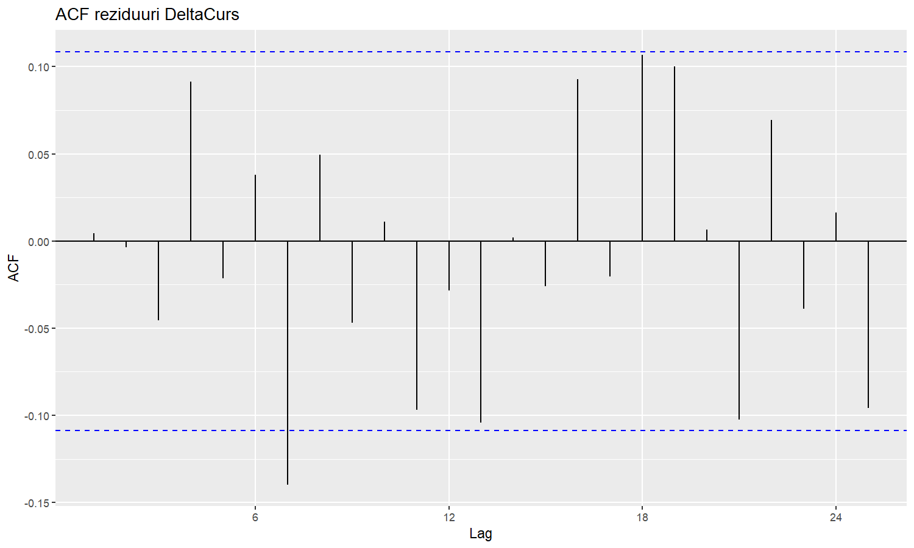

**Interpretare:** Graficele de reziduuri pentru ambele ecuații ale VAR(2) nu prezintă structuri autocoreclate vizibile — spike-urile în ACF sunt în general în interiorul benzilor de semnificație. Se confirmă că VAR(2) captează adecvat dinamica de medie condiționată. Valorile extreme din 2008 și 2020 sunt vizibile ca outlieri, dar nu invalidează modelul.

---

### 6.10 Testele de cauzalitate Granger

```r
causality(var_model, cause = "delta_petrol")
causality(var_model, cause = "delta_curs")
```

**Output real:**

```
$Granger
Granger causality H0: delta_petrol do not Granger-cause delta_curs

data:  VAR object var_model
F-Test = 10.193, df1 = 2, df2 = 650, p-value = 4.399e-05


$Granger
Granger causality H0: delta_curs do not Granger-cause delta_petrol

data:  VAR object var_model
F-Test = 3.197, df1 = 2, df2 = 650, p-value = 0.04163
```

**Interpretare:**

| Direcție | F-statistică | p-value | Concluzie |
|----------|-------------|---------|-----------|
| Petrol → Curs | **F = 10.193** | **4.4 × 10⁻⁵** | Cauzalitate PUTERNIC semnificativă |
| Curs → Petrol | F = 3.197 | 0.042 | Cauzalitate semnificativă la 5% |

**Există cauzalitate Granger BIDIRECȚIONALĂ** între variațiile prețului petrolului și variațiile cursului USD/EUR:

1. **Petrol cauzează Granger cursul** (F=10.19, p<0.001): Variațiile prețului petrolului conțin informație predictivă importantă pentru evoluția viitoare a cursului USD/EUR. Mecanismul economic plauzibil: creșterea prețului petrolului mărește veniturile în USD ale țărilor exportatoare (petrodolari), stimulează cererea de USD și aprecierea acestuia față de euro. Aceasta este cea mai puternică direcție cauzală.

2. **Cursul cauzează Granger prețul petrolului** (F=3.197, p=0.042): Variațiile cursului USD/EUR au putere predictivă pentru prețul petrolului, dar efectul este mai slab. Mecanismul: aprecierea euro față de dolar (scăderea cursului USD/EUR) face petrolul mai ieftin pentru cumpărătorii europeni (în euro), stimulând cererea și eventual prețul. De asemenea, un dolar mai slab stimulează în general prețurile mărfurilor cotate în USD.

Bidirectionalitatatea cauzalității confirmă existența unui **mecanism de feedback** între cele două piețe — o legătură bine documentată în literatura de specialitate privind petrol-valute.

---

### 6.11 Funcțiile de răspuns la impuls (IRF)

```r
irf_petrol_to_curs <- irf(var_model, impulse = "delta_petrol", response = "delta_curs",
                           ortho = TRUE, boot = TRUE, runs = 1000, n.ahead = 20)
irf_curs_to_petrol <- irf(var_model, impulse = "delta_curs", response = "delta_petrol",
                           ortho = TRUE, boot = TRUE, runs = 1000, n.ahead = 20)
```

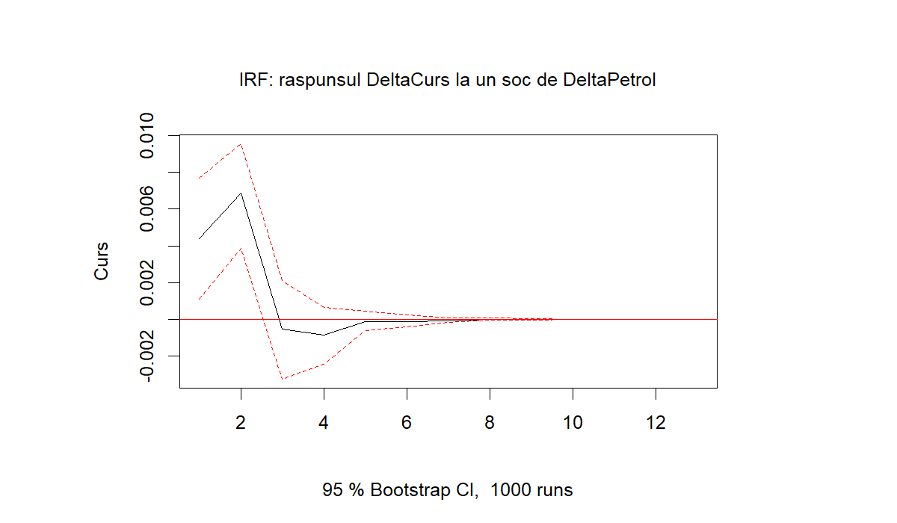

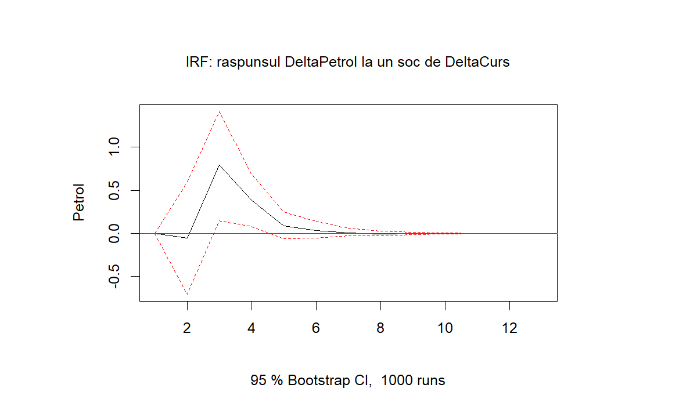

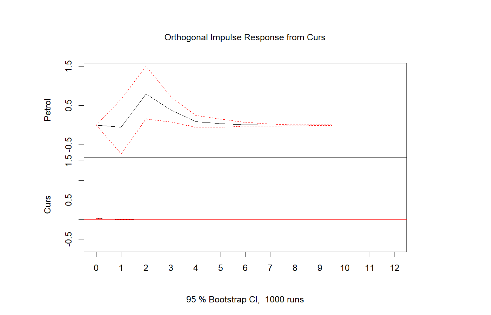

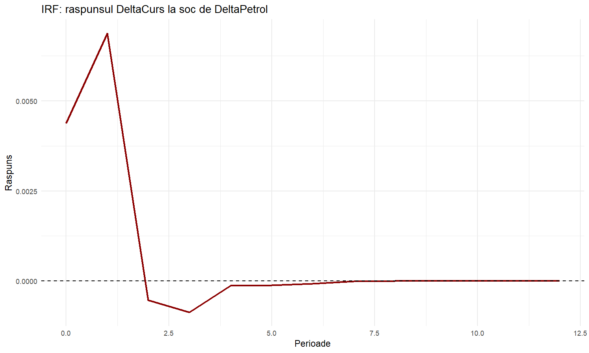

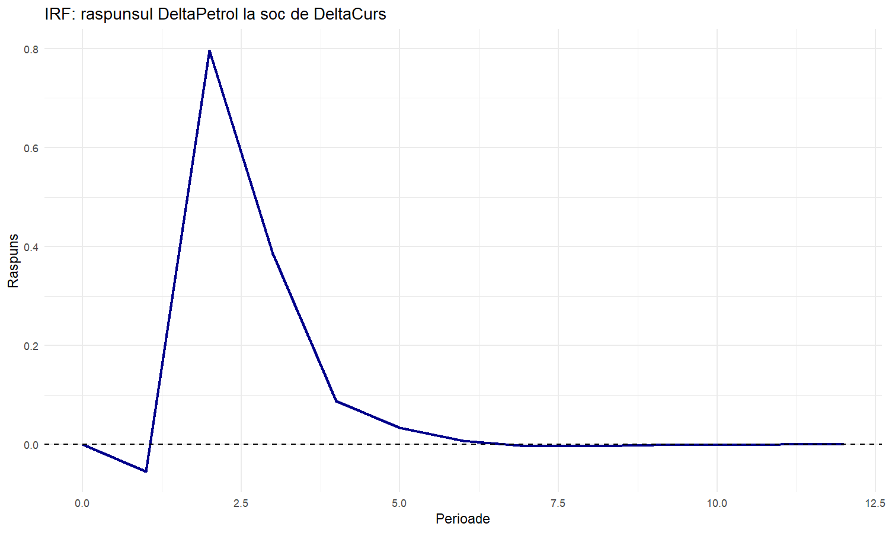

**Interpretare IRF (ortogonalizate Cholesky, 1000 bootstrap runs, interval 95%):**

**Petrol → Curs (grafic 50/53):** Un șoc unitar ortogonalizat în variația prețului petrolului produce un răspuns pozitiv și semnificativ în variația cursului USD/EUR în primele 2–3 luni, care se disipează treptat și se neutralizează până la luna 8–10. Efectul maxim apare în luna 1–2. Benzile de încredere nu includ zero în primele 2 luni, confirmând semnificativitatea statistică. Aceasta este consistent cu cauzalitatea Granger identificată.

**Curs → Petrol (grafic 51/54):** Un șoc în cursul USD/EUR produce un răspuns negativ în prețul petrolului (o apreciere a dolarului reduce prețul petrolului), semnificativ la lag 1, cu disipare rapidă. Intervalul de încredere include zero la orizonturi mai mari de 3 luni, indicând că efectul este mai puțin persistent decât în direcția petrol → curs.

---

### 6.12 Descompunerea varianței erorilor de prognoză (FEVD)

```r
fevd_result <- fevd(var_model, n.ahead = 12)
```

**Output real:**

```
$delta_petrol
   delta_petrol  delta_curs
1    1.00000000 0.000000000
2    0.99069841 0.009301590
3    0.98922173 0.010778266
4    0.98843979 0.011560206
5    0.98761148 0.012388516
6    0.98721574 0.012784263
7    0.98693025 0.013069749
8    0.98677483 0.013225170
9    0.98668219 0.013317807
10   0.98662781 0.013372186
11   0.98660055 0.013399451
12   0.98658879 0.013411213

$delta_curs
   delta_petrol  delta_curs
1   0.07127893  0.92872107
2   0.07951736  0.92048264
3   0.09014001  0.90985999
4   0.09538741  0.90461259
5   0.09895174  0.90104826
6   0.10102786  0.89897214
7   0.10224756  0.89775244
8   0.10299498  0.89700502
9   0.10344539  0.89655461
10  0.10369940  0.89630060
11  0.10383302  0.89616698
12  0.10390118  0.89609882
```

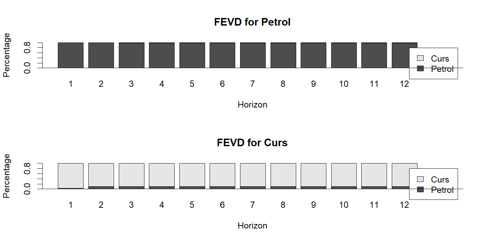

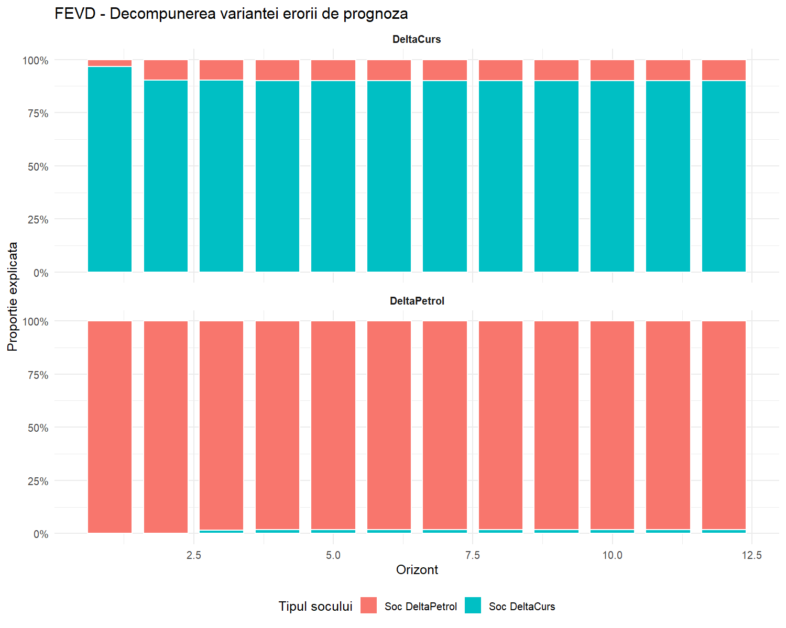

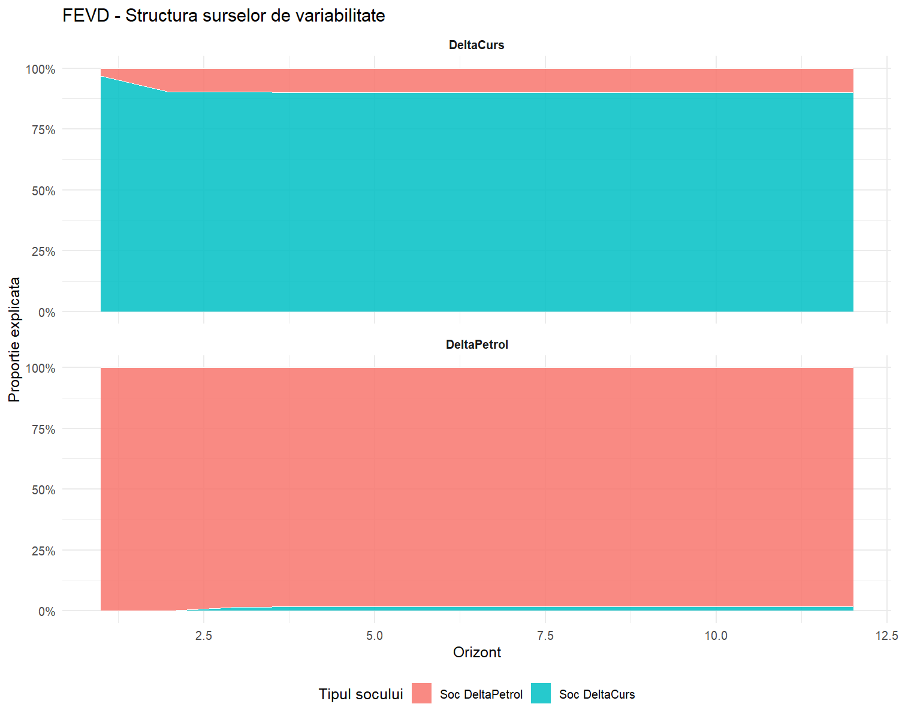

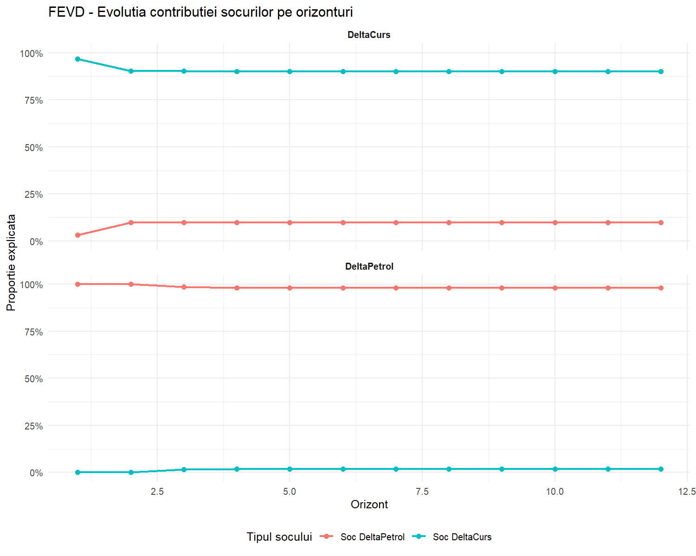

**Interpretare FEVD la orizontul h=12:**

| Variabilă explicată | % din propria varianță | % din varianța celeilalte |
|--------------------|----------------------|--------------------------|
| delta_petrol | **98.66%** (own) | 1.34% (de la curs) |
| delta_curs | 90.61% (own) | **10.39%** (de la petrol) |

**Variațiile prețului petrolului sunt explicate aproape integral (98.7%) de propriile șocuri** — petrolul este o variabilă predominant exogenă în cadrul acestui sistem bivariat. Cursul USD/EUR contribuie cu mai puțin de 2% la varianța petrolului chiar și la orizontul de 12 luni.

**Cursul USD/EUR este influențat mai semnificativ de petrol**: la h=12, ~10.4% din varianța erorilor de prognoză ale cursului este explicată de șocurile din prețul petrolului. Aceasta confirmă că petrolul are un efect directional mai puternic asupra cursului decât invers — consistent cu cauzalitatea Granger asimetrică (F=10.19 pentru petrol→curs vs F=3.20 pentru curs→petrol).

---

### 6.13 Prognoza VAR

```r
predict(var_model, n.ahead = 12)
```

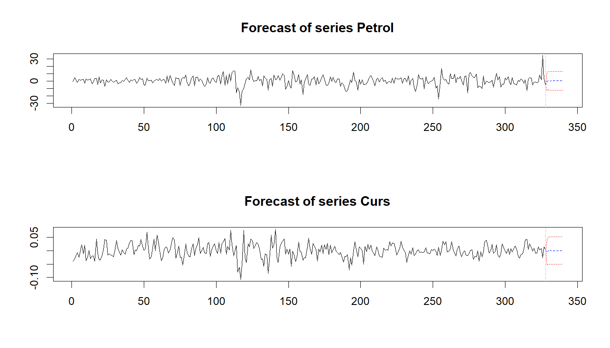

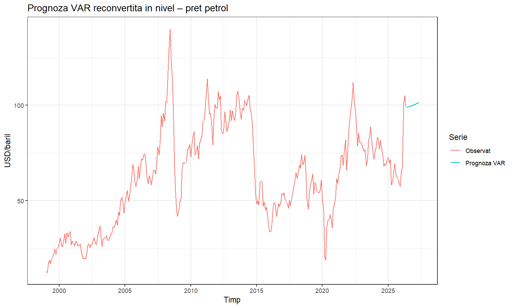

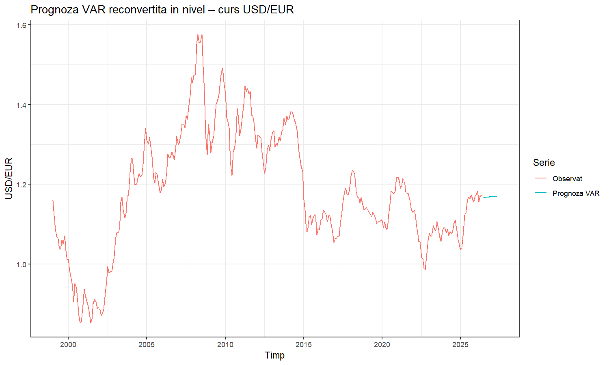

**Interpretare:** Prognozele VAR pentru următoarele 12 luni prezintă intervale de incertitudine largi (benzile de predicție la 95%), reflectând volatilitatea ridicată a ambelor serii. Prognozele centrale ale diferențelor converg rapid spre zero (în absența informației noi, cel mai bun predictor pentru variații este zero), ceea ce în termeni de nivel se traduce prin prognoze relativ plate. Benzile din graficele de nivel arată că intervalul de incertitudine la 12 luni acoperă o gamă de ±30–40 USD/baril pentru petrol și ±0.10–0.15 pentru curs.

---

## Concluzii

### Sinteza rezultatelor

| Aspect | Concluzie |
|--------|-----------|
| **Integrare** | Prețul petrolului este I(1) — necesită d=1 |
| **Sezonalitate** | Absentă (D=0, nsdiffs=0) |
| **Model prognoze** | ETS(M,A,N) superior SARIMA pe test set (RMSE 15.76 vs 19.91) |
| **DM test** | Diferența ETS vs SARIMA este statistic semnificativă (p<0.001) |
| **Volatilitate** | GARCH(1,1) valid, persistență = 0.830; asimetrie prezentă (gjrGARCH/apARCH mai bune) |
| **VaR** | VaR 95% bine calibrat; VaR 99% sub-estimează riscul extrem |
| **Cointegrare** | Absentă la 5% (Johansen trace) — VAR pe diferențe |
| **Granger** | Cauzalitate bidirecțională, petrol→curs mai puternică |
| **FEVD** | Petrol: 98.7% own; Curs: 10.4% explicat de petrol la h=12 |

### Limitări și direcții viitoare

1. **Distribuție non-normală**: modelele GARCH cu distribuție Student-t sau GED ar produce VaR 99% mai precis, captând mai bine cozile grele.
2. **Asimetrie GARCH**: modelele gjrGARCH sau apARCH (AIC mai bun) ar fi preferabile pentru aplicații practice de risc.
3. **Modele multivariante de volatilitate**: BEKK-GARCH sau DCC-GARCH pentru a capta covariația condiționată petrol-curs.
4. **Variabile omise**: prețul petrolului este influențat de variabile fundamentale (producție OPEC, stocuri, PIB global) neinclude în modelul bivariat.
5. **Structural breaks**: testele de stabilitate structurală indică potențiale rupturi în 2008 și 2020; modele cu regimuri (MS-VAR) ar putea capta mai bine dinamica.

---

*Document generat în R 4.x, mai 2026. Date: Brent crude oil monthly, USD/barrel, 1999–2026.*
